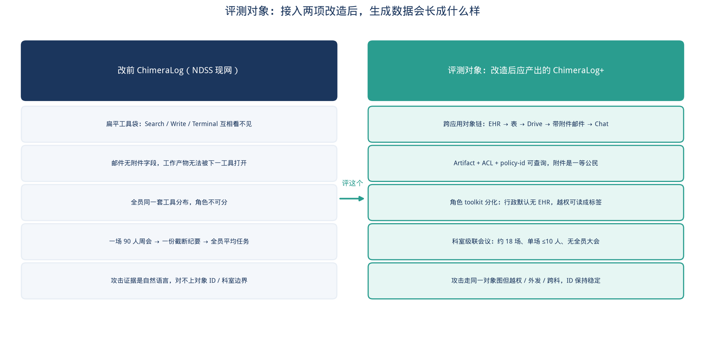
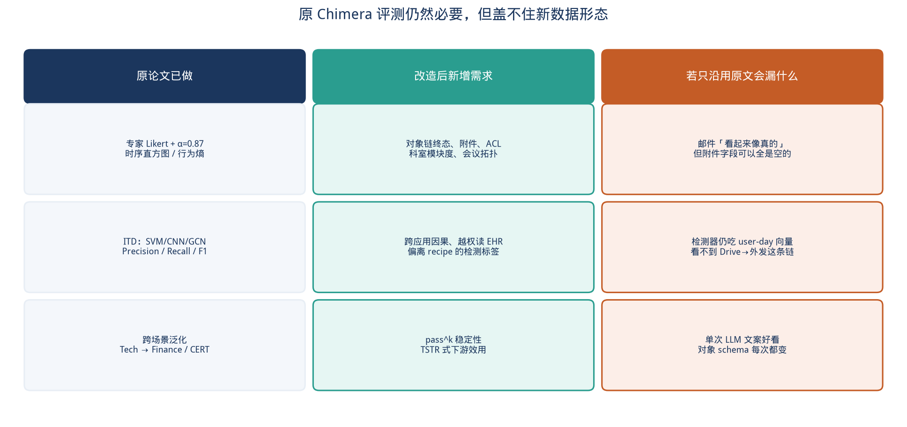
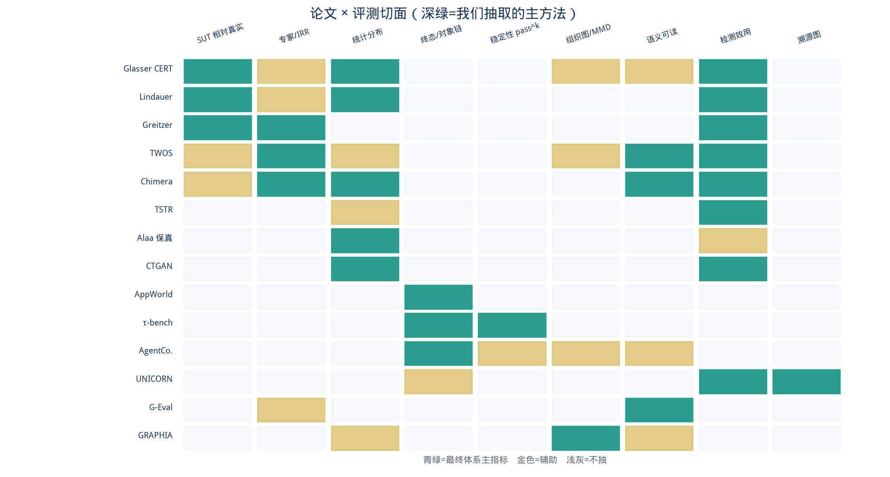
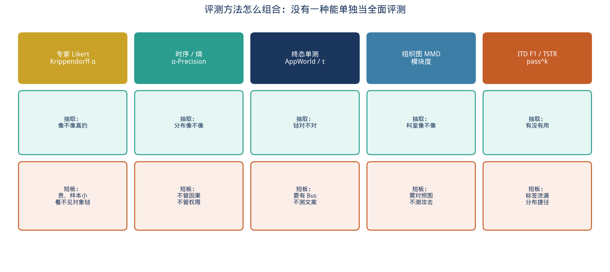
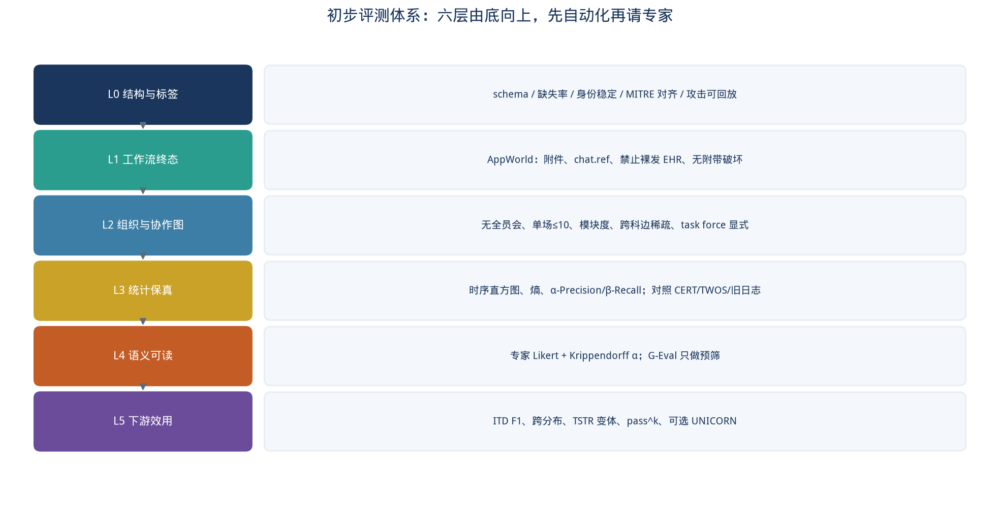

# Chimera 生成数据集初步评测体系

> 评测对象不是「工具联通」或「员工分组」这两个功能本身，而是：**把这两项改造接到仿真主循环之后，框架产出的 ChimeraLog（下称 ChimeraLog+）好不好、稳不稳、对内部威胁检测有没有用。**
>
> 文档版本：2026-09-18　|　工作分支：`cursor/dataset-eval-research-0928`　|　可执行切片：`src/dataset_eval.py`

---

## 1. 结论先行

原 NDSS 论文已经用 **专家 Likert + Krippendorff α、时序直方图 / 行为熵、ITD 的 Precision/Recall/F1、跨场景泛化** 评过 ChimeraLog。这一套对「日志看起来像不像企业行为、检测器能不能学」仍然必要，但 **盖不住改造后的新数据形态**：

| 改造 | 数据里多出来的东西 | 原文评测看不见 |
| --- | --- | --- |
| 工具联通（PR #6） | Artifact 对象链、附件、ACL、角色 toolkit、policy-id | 邮件可以文案很真、附件字段全空 |
| OrgCascade（PR #7） | 科室树、级联会议、`reports_to`、跨科稀疏图 | 全员平均任务也会得到高 Likert |

**没有一种论文方法能单独当全面评测。** 建议按六层由底向上做初步体系，先自动化再请专家：

1. **L0 结构与标签** — schema、缺失、身份稳定、MITRE 可回放
2. **L1 工作流终态** — 抽 AppWorld / τ-bench：看对象链终态，不看死板 API 序列
3. **L2 组织与协作图** — 无全员会、单场人数、模块度、跨科边
4. **L3 统计保真** — 抽 CERT 生成哲学 + Alaa：对照 CERT / TWOS / 旧 ChimeraLog
5. **L4 语义可读** — 沿用 Chimera 专家协议；G-Eval 只做预筛
6. **L5 下游效用** — 沿用 ITD F1 + 跨分布；补 TSTR 变体与 `pass^k`

本仓库已对 **L1 / L2** 接到现有原型上：流感周报必须带 Drive 附件且 chat 引用邮件；90 人医院会议规划必须无全员会、单场 ≤10、治理会仅负责人。L3–L5 等第一次 ChimeraLog+ 跑出来再填数。



---

## 2. 评测对象：ChimeraLog+ 会长什么样

两项改造都还没有接到 Phase 1–3 主循环。因此「现在再跑一遍仿真」得到的仍是旧 ChimeraLog。评测设计必须按 **接线后应产出的数据** 来写，否则会评错对象。

### 2.1 旧 ChimeraLog（NDSS 现网）

- 应用层：logon / email / web / file；系统层：pcap / sysdig
- 邮件字段 `from, to, cc, subject, content`，**没有附件对象**
- `daily_summary` 只有自然语言；OWL 任务互不可见
- 攻击 `observable_evidence` 是英文散文
- 90 人时周会是一场 Workforce，纪要截断后抽出全员周目标

原文用这份数据证明：专家认为语义比 CERT 真、检测比 CERT 难、跨场景可泛化。

### 2.2 ChimeraLog+（评测目标）

在保留原六模态的前提下，日志应多出可查询的应用层对象图：

```text
ehr_export → table → drive://epi/week-12/flu.csv
         → email(attachments=[drive]) → chat(ref=mail_id)
```

同时组织侧应变为：

- 成员 jsonc 带 `department` / `team` / `unit_path` / `is_lead` / `reports_to`
- 周会约 18 场、单场 ≤10、治理会只请科室负责人
- 正常协作以科室为社区；跨科只走负责人和显式 task force
- 攻击仍按稳定 `id` 注入，但走同一对象图的越权 / 外发 / 跨科边

**评测问题因此变成五个，而不是「再打一次 Likert」：**

1. 对象链是否闭合（附件、引用、ACL）？
2. 组织图是否像医院而不是全连接群聊？
3. 统计形态是否仍接近（或不劣于）旧 ChimeraLog / TWOS？
4. 人读起来是否仍像真的企业日志？
5. 用它训练的检测器是否更难、更可泛化，而不是因为标签捷径变好？



---

## 3. 调研范围与筛选标准

检索来源：arXiv / Hugging Face Papers / IEEE S&P Workshops / ACL / NDSS / NeurIPS D&B。**不**按「工具组合论文」或「多智能体分组论文」检索，而按「合成 / 仿真出来的行为日志或职场轨迹，文献怎么证明它能用」。

入选条件（至少两条）：

1. 直接评 **生成或采集的内部威胁 / 企业日志数据集**；
2. 给出可复现的 **保真、多样性、稳定性或下游效用** 指标；
3. 能接到 ChimeraLog+ 的新形态（对象终态、组织图、多模态日志），而不是只评单条文本。

下面 14 篇均满足。第 4 节逐篇写清抽取哪一刀；第 5 节对照优缺点；第 6 节才是我们的初步体系。



---

## 4. 相关论文（14 篇）

每篇固定四段：**论文在评什么** / **优点** / **缺点（相对 ChimeraLog+）** / **我们抽取哪一刀**。

### 4.1 Glasser & Lindauer — CERT 合成数据的「相对真实」哲学

- Glasser, J. & Lindauer, B. *Bridging the Gap: A Pragmatic Approach to Generating Insider Threat Data*. IEEE SPW 2013. [PDF](https://www.ieee-security.org/TC/SPW2013/papers/data/5017a098.pdf)
- **在评什么**：DARPA ADAMS 用合成日志代替无法公开的企业数据。核心论断是：**真实只相对于被测系统（SUT）的维度存在**；未写入需求的维度不会碰巧真实。
- **优点**：把「像不像真的」从开放问题收成可测需求；强调背景行为模型与威胁信号的可调性；明确合成数据适合验证性实验，不适合当探索性「发现未知威胁」的唯一证据。
- **缺点**：CERT 自己后来被 Chimera 专家打到 Likert 1.78——语义贫瘠。只按 SUT 维度设计，容易漏掉附件、科室、ACL 这些当时检测器不用的维度。
- **抽取**：评测规格必须先写 **SUT 维度清单**（我们的 SUT = 内部威胁检测器 + 人类分析员）。ChimeraLog+ 的新维度（对象链、科室图）一旦被检测器使用，就必须进入通过线，而不是「有空再看」。

### 4.2 Lindauer 等 — 把 CERT 生成器调参当成评测循环

- Lindauer, B. 等. *Generating Test Data for Insider Threat Detectors*. Journal of Wireless Mobile Networks, Ubiquitous Computing, and Dependable Applications, 2014. [PDF](https://jowua.com/wp-content/uploads/2022/12/jowua-v5n2-5.pdf)
- **在评什么**：用检测团队的反馈迭代生成器；讨论「直接生成可观测量」vs「先建模潜伏动机再生成观测」。
- **优点**：评测不是一次性打分，而是 **生成 → 找假象 → 改参数** 的循环；对内部威胁这种极不平衡数据特别务实。
- **缺点**：依赖有检测团队可问；没有对象终态协议；潜伏变量模型很难验证。
- **抽取**：初步体系必须能 **指出假象**（例如全员同一 toolkit、邮件无附件、全员大会）。L1/L2 的失败项应直接打回生成器，而不是只报一个总分。

### 4.3 Greitzer & Ferryman — 检测工具的有效性指标

- Greitzer, F. L. & Ferryman, T. A. *Methods and Metrics for Evaluating Analytic Insider Threat Tools*. IEEE SPW 2013. [PDF](https://www.ieee-security.org/TC/SPW2013/papers/data/5017a090.pdf)
- **在评什么**：运营环境里真实恶意人数未知时，如何评分析工具。提出注入测试、已知结果测试，以及 **Enrichment Ratio / Bayes Factor**：相对基线，工具让分析员少看多少人才能找到同样多的 POI。
- **优点**：把 F1 翻译成「省多少人力」；承认 ROC 不够；适合 Chimera 这种「数据是为检测服务」的定位。
- **缺点**：评的是 **工具** 不是 **数据集**；没有数据保真协议；Enrichment Ratio 需要基线审查名单。
- **抽取**：L5 除 F1 外，报告 **在固定审查预算 k 下的 Recall@k / Enrichment Ratio**。数据集若只让 F1 变高、审查预算下召回不变，则效用存疑。

### 4.4 Harilal 等 — TWOS：真人竞赛采集的对照集

- Harilal, A. 等. *TWOS: A Dataset of Malicious Insider Threat Behavior Based on a Gamified Competition*. MIST@CCS 2017. [DOI](https://doi.org/10.1145/3139923.3139929)
- **在评什么**：24 人 / 5 天 / 320 小时，含键盘鼠标、文件系统、网络、SMTP、登录，以及伪装者和叛徒时段。Chimera 原文把它当「真人对照」。
- **优点**：有真实人交互与红队动机；多源异构；有团队编制和伪装时段的 ground truth。
- **缺点**：规模小、周期短、学生竞赛、大量脱敏导致对话碎片化（Chimera 原文已指出）；不能当分布意义上的「真实企业」。
- **抽取**：L3/L4 的 **对照集之一**，只比人类可读模态（邮件、登录、文件），不比对象链（TWOS 没有 Artifact Bus）。Likert 协议继续用 Chimera 原文的分层抽样。

### 4.5 Yu 等 — Chimera 原文评测（必须保留的基线）

- Yu 等. *Chimera: Harnessing Multi-Agent LLMs for Automatic Insider Threat Simulation*. NDSS 2026. [PDF](https://www.ndss-symposium.org/wp-content/uploads/2026-f375-paper.pdf)
- **在评什么**：① 五位专家、每集 100 条、五级 Likert、Krippendorff α=0.87；② 小时活动直方图、行为熵、序列复杂度；③ SVM / 时序 CNN / GCN / DS-IID 的 P/R/F1（五次平均）；④ Tech → Finance / CERT 的跨数据集泛化。
- **优点**：已证明「语义丰富」和「检测更难」可以同时成立；跨场景设置正好对应医院 / 游戏 / 金融多剧本；IRR 报告规范。
- **缺点**：评的是 **旧 ChimeraLog**。user-day 特征向量吃不到附件、ACL、科室；分层抽样按模态不按对象链；没有稳定性 `pass^k`。
- **抽取**：L3/L4/L5 的 **对照实验协议原样保留**，在 ChimeraLog+ 上重跑，回答「更像真的正常行为会不会让旧检测器失效」。

### 4.6 Esteban, Hyland, Rätsch — TSTR：合成数据有没有用

- Esteban, C., Hyland, S. L. & Rätsch, G. *Real-valued (Medical) Time Series Generation with Recurrent Conditional GANs*. arXiv:1706.02633. [arXiv](https://arxiv.org/abs/1706.02633)　[HF](https://huggingface.co/papers/1706.02633)
- **在评什么**：**Train on Synthetic, Test on Real (TSTR)** —— 用合成数据训练监督模型，在真实持有集上测试。反向还有 TRTS。
- **优点**：直接回答「数据能不能用」，不依赖单条样本好不好看；是合成数据文献的标准效用协议。
- **缺点**：内部威胁几乎没有可公开的「Real」。用 CERT/TWOS 当 Real 会有域差；TSTR 高也可能来自标签捷径（例如攻击日标志位）。
- **抽取**：做 **TSTR 变体**，不幻想有医院真日志：Train on ChimeraLog+ / Test on 旧 ChimeraLog 与 CERT 用户日特征；并设 **Train on ChimeraLog+ / Test on ChimeraLog+ 持有集** 作为上界。若 TSTR 远低于同分布 F1，说明新数据分布漂移过大或捷径变了。

### 4.7 Alaa 等 — α-Precision / β-Recall / Authenticity

- Alaa, A. 等. *How Faithful is your Synthetic Data? Sample-level Metrics for Evaluating and Auditing Generative Models*. ICML 2022. [arXiv:2102.08921](https://arxiv.org/abs/2102.08921)　[HF](https://huggingface.co/papers/2102.08921)
- **在评什么**：与领域无关的三维：保真（α-Precision）、多样（β-Recall）、是否抄训练集（Authenticity）。
- **优点**：能诊断「只生成几种典型工作日」vs「乱生成不像人」；样本级可审计，可丢掉低质量天。
- **缺点**：需要嵌入空间；日志事件要先向量化；Authenticity 在我们没有「训练用真日志」时含义变成「是否抄旧 ChimeraLog / 提示词模板」，需改写定义。
- **抽取**：L3 用 **用户-日特征向量**（与原文 ITD 特征同一套）算 α-Precision / β-Recall，对照旧 ChimeraLog。Authenticity 改成「与提示词模板 / 攻击 JSON 原文的 n-gram 重叠」，抓 LLM 复读。

### 4.8 Xu 等 — CTGAN 的表格合成评测套件

- Xu, L. 等. *Modeling Tabular data using Conditional GAN*. NeurIPS 2019. [arXiv:1907.00503](https://arxiv.org/abs/1907.00503)　[HF](https://huggingface.co/papers/1907.00503)
- **在评什么**：混合类型表格的似然拟合 + 机器学习效能（在合成表上训，在真表上测）。后续 SDMetrics 把这条产品化。
- **优点**：协议成熟、开源、适合 logon/file 这种列式日志；对类别不平衡有讨论。
- **缺点**：假设「有一张真表」。对象图、自然语言邮件、时序依赖会被拍扁；ML efficacy 不等于威胁检测。
- **抽取**：只对 **可对齐的列式子集**（每用户每日：登录次数、邮件数、文件写次数、下班后事件比例）做 KS / TV 距离。不做整库 GAN。

### 4.9 Trivedi 等 — AppWorld：终态单测，而不是 API 序列

- Trivedi, H. 等. *AppWorld: A Controllable World of Apps and People for Benchmarking Interactive Coding Agents*. ACL 2024. [arXiv:2407.18901](https://arxiv.org/abs/2407.18901)　[HF](https://huggingface.co/papers/2407.18901)
- **在评什么**：比较任务前后数据库 diff：该改的改了、不该改的没改（collateral damage）。指标 TGC / SGC。
- **优点**：允许多种合法路径；正好对应「流感周报可以先透视表再存盘，也可以先存盘再发邮件，但终态必须有附件」。能抓「删了不该删的病历」。
- **缺点**：评的是 agent 任务成功，不是数据集分布；需要权威状态库（我们的 Artifact Bus）；写单测成本高。
- **抽取**：L1 的主协议。黄金路径 `flu_trend_demo` 已按此断言附件数与 `chat.ref`。接入日循环后，对每个剧本写 **终态单测包**（正常周报、越权读 EHR、外发私人邮箱）。

### 4.10 Yao 等 — τ-bench：政策遵守与 pass^k

- Yao, S. 等. *τ-bench: A Benchmark for Tool-Agent-User Interaction in Real-World Domains*. 2024. [arXiv:2406.12045](https://arxiv.org/abs/2406.12045)　[HF](https://huggingface.co/papers/2406.12045)
- **在评什么**：对话结束时数据库是否等于标注目标；**pass^k** = 同一任务 k 次独立试验全部成功的期望比例。
- **优点**：抓住 LLM 仿真最致命的问题——**不稳定**。政策文本（零售/航空）与 Chimera 的 ACL /「禁止裸发 EHR」同构。
- **缺点**：pass^k 要重复跑，token 贵；用户模拟器与 Chimera 的员工社会不完全一样；原指标是任务成功不是数据质量。
- **抽取**：L1 政策断言 + L5 稳定性。同一周报 / 同一攻击剧本跑 k=3（初步）到 k=8（论文级），看对象 schema 是否稳定（有无附件、acl 形态、收件人域）。**不**要求邮件正文逐字相同。

### 4.11 Xu 等 — TheAgentCompany：职场长程检查点

- Xu, F. 等. *TheAgentCompany: Benchmarking LLM Agents on Consequential Real World Tasks*. NeurIPS 2025 D&B. [arXiv:2412.14161](https://arxiv.org/abs/2412.14161)　[HF](https://huggingface.co/papers/2412.14161)
- **在评什么**：真实职场（Drive / Chat / Tickets）上的长程任务，报告 **完全完成 / 部分完成（检查点）** 与沟通。
- **优点**：承认职场任务很少二元成功；检查点可映射到攻击链的 MITRE 步骤；环境选型与 Chimera L1 应用层一致。
- **缺点**：评 agent 不是评数据集；自托管套件重，Chimera 已明确不在本阶段 docker 化 GitLab。
- **抽取**：把攻击 JSON 的 `how[]` 当成 **检查点列表**。ChimeraLog+ 不要求每步 API 名一致，但要求每步有对应 artifact / 日志源。部分完成率用于诊断「攻击注入了但没留下痕迹」。

### 4.12 Han 等 — UNICORN：溯源图上的检测效用

- Han, X., Pasquier, T. 等. *UNICORN: Runtime Provenance-Based Detector for Advanced Persistent Threats*. NDSS 2020. [arXiv:2001.01525](https://arxiv.org/abs/2001.01525)　[HF](https://huggingface.co/papers/2001.01525)
- **在评什么**：在整机 provenance 图上做异常检测，用 DARPA TC 与 StreamSpot 数据报 precision/recall，并强调多跳上下文。
- **优点**：Chimera 已采 sysdig；对象 Bus 让应用层边可以对齐到系统层边。适合回答「跨应用链会不会在溯源图上可见」。
- **缺点**：部署和特征工程重；APT 检测 ≠ 内部威胁；初步阶段不该作为门禁。
- **抽取**：L5 **可选加深**。先检查应用层 artifact 边能否投影到 file/net 事件；完整 UNICORN 复现放到有完整 scap 的跑次之后。

### 4.13 Liu 等 — G-Eval：用 LLM 预筛文本质量

- Liu, Y. 等. *G-Eval: NLG Evaluation using GPT-4 with Better Human Alignment*. EMNLP 2023. [arXiv:2303.16634](https://arxiv.org/abs/2303.16634)　[HF](https://huggingface.co/papers/2303.16634)
- **在评什么**：CoT + 填表式打分，评摘要/对话的连贯、流畅等，与人类相关高于 BLEU/ROUGE。
- **优点**：邮件、纪要、周报正文可以低成本扫一遍；维度可改成「是否像医院工作邮件」。
- **缺点**：原文已警告 **LLM 偏爱 LLM 文本**——用 DeepSeek 生成再用 GPT 打分会虚高；不能替代专家 Likert。
- **抽取**：L4 **预筛**，不进最终论文主表。专家协议仍走 Chimera 原文。G-Eval 只用来丢掉明显复读、角色串岗、中英混杂的样本。

### 4.14 GRAPHIA — 社交仿真图的宏观 MMD

- *GRAPHIA: Harnessing Social Graph Data to Enhance LLM-Based Social Simulation*. ACL 2026. [ACL](https://aclanthology.org/2026.acl-long.322/)
- **在评什么**：微观边是否合理 + 宏观度分布 / 聚类系数 / 谱的 MMD，用来评 LLM 社会仿真像不像真图。
- **优点**：OrgCascade 的核心承诺就是「科室社区，而不是全连接」。MMD 和模块度正好能量化这件事。
- **缺点**：需要对照图（可用组织树的「应然图」：组内全连接、组间只经负责人）；MMD 对节点数敏感；不评内容。
- **抽取**：L2 主指标。用邮件/会议/chat 边建周图，算 **组内边比例、跨科边比例、Louvain 模块度、相对应然图的度分布 MMD**。90 人医院的应然图来自 `src/org_structure.py` 的 assignments。

---

## 5. 方法优缺点对照



| 方法族 | 代表论文 | 优点 | 缺点 | 初步体系中的位置 |
| --- | --- | --- | --- | --- |
| SUT 相对真实 + 迭代找假象 | Glasser, Lindauer | 防止「真实」变成无底洞；能指导改生成器 | 不写进规格的维度会假 | 全局原则；L0 假象清单 |
| 运营有效性 | Greitzer | 把检测结果翻译成审查成本 | 评工具不评数据；要基线名单 | L5 Recall@k / ER |
| 真人对照 + 专家 Likert | TWOS, Chimera | 语义、工作节奏、可信度 | 贵、样本小、看不到对象链 | L4 主指标 |
| 统计 / 样本级保真 | Alaa, CTGAN, Chimera 直方图 | 可自动、可对照旧数据 | 拍扁因果与权限 | L3 |
| 终态 + 政策 | AppWorld, τ-bench | 允许多路径；抓附件/ACL | 依赖 Bus；不测文案 | L1 门禁 |
| 长程检查点 | TheAgentCompany | 攻击链可部分记分 | 评 agent；环境重 | 攻击回放 |
| 图保真 | GRAPHIA | 直接量科室结构 | 要应然图 | L2 门禁 |
| 稳定性 | τ-bench pass^k | 抓 LLM 抖动 | token 贵 | L5，k=3 起步 |
| 下游效用 | TSTR, Chimera ITD, UNICORN | 回答「有没有用」 | 捷径、域差、成本 | L5；UNICORN 可选 |
| LLM-as-judge | G-Eval | 便宜扫正文 | 偏爱 LLM 文本 | L4 预筛 only |

**不能做的替代：**

- 不能只用 Likert 宣布 ChimeraLog+ 成功（会忽略空附件、全员会）。
- 不能只用 ITD F1（标签捷径或正常行为变简单都会抬 F1）。
- 不能只用终态单测（对象对了，文案仍可能是 CERT 式空壳）。
- 不能把 G-Eval 当专家。

---

## 6. 初步评测体系

原则沿 Glasser：**先写 SUT 维度，再测这些维度。** 我们的 SUT 有两个消费者——① 内部威胁检测模型；② 读日志的安全分析员。



### 6.1 L0 结构与标签（门禁，全自动）

针对一次仿真 dump（`email.csv`、file/http/logon、`daily_summary_*.json`、成员 jsonc、攻击注入记录）：

| 检查 | 通过线（初步） |
| --- | --- |
| 必填字段缺失率 | < 1% |
| 员工 ID 稳定 | 与 Phase 1 档案 100% 可连接；禁止运行时换人 |
| 时间单调 | 单用户事件时间戳非递减（允许并行线程的秒级并列） |
| 攻击可回放 | 每个 `how[].step` 至少命中一条日志或一个 artifact |
| MITRE 字段 | `technique_id` 非空且能在 ATT&CK 企业矩阵解析 |
| 新旧字段共存 | 旧六模态仍在；新字段（附件、artifact_id、department）允许先空，但 **空的比例必须报告**，不能静默 |

L0 失败则不进入 L3–L5。假象清单（Lindauer 循环）：全员 toolkit 相同、邮件附件全空、一场全员会、攻击只有散文没有对象。

### 6.2 L1 工作流终态（门禁，AppWorld 风格）

不比较 API 序列，比较 **Bus / 日志终态**：

**正常黄金路径（流感周报，已在原型落地）**

- 存在 `drive_object`，路径含业务前缀（如 `epi/`）
- 存在一封邮件，`attachments.length ≥ 1`，附件类型不是裸 `ehr_record`
- 存在一条 chat，`ref` 等于该邮件 `artifact_id`
- EHR 记录默认不对无关员工 `visible_to`

**攻击路径（接线后）**

- 外发：附件仍指向内部 artifact，但收件人域外或 `acl` 扩到私人地址
- 越权：行政角色出现 `ehr_record` 读事件（角色默认无 EHR）
- 破坏：Tickets / Terminal 清日志，但 Bus 仍留审计对象

**附带破坏（AppWorld collateral）**：终态不得删除无关员工的 Drive / EHR。

实现切片：`src/dataset_eval.py` 的 `score_workflow_final_state()`。

### 6.3 L2 组织与协作图（门禁）

用 OrgCascade 的应然图当对照：

| 指标 | 90 人医院通过线 |
| --- | --- |
| 全员大会场数 | 0 |
| 单场人数 | ≤ `max_group_size`（默认 10） |
| 治理会成员 | ⊆ `is_lead` |
| 成员身份 | 每人都有稳定 `member_id` 与 `unit_path` |
| 周协作图模块度 | 高于全连接 / 随机图；组内边比例显著高于跨科 |
| 跨科边 | 应主要落在负责人或 task force；其余跨科边记为异常候选（不一定是攻击） |

实现切片：`score_org_topology()`。图 MMD / 模块度等第一次有邮件图再算。

### 6.4 L3 统计保真（对照实验，非门禁）

沿用 Chimera 原文的小时直方图、行为熵、序列复杂度，加上 Alaa / CTGAN 列式距离：

- 对照：旧 ChimeraLog、CERT r6.2、TWOS（仅对齐模态）
- 特征：用户-日向量（登录、邮件、文件、Web、下班后比例、唯一对端数）
- 指标：直方图 L1、KS、TV、α-Precision / β-Recall
- **解释约定**（避免误读）：ChimeraLog+ 的「角色分化」会让全员混合熵上升、组内熵下降。应 **分科室报**，不要只看全局熵变低就判失败。

### 6.5 L4 语义可读（小样本，主表仍用专家）

**主协议（照抄 Chimera 原文，便于前后对比）**

- 每数据集 100 条；四个人类可读模态；良恶各 50；Neyman / 比例分层
- 五位专家、五级 Likert、工作日节奏 + 「是否像生产环境」
- 报告均值与 Krippendorff α（目标 α ≥ 0.67，争取与原文 0.87 同级）

**预筛（G-Eval，不进主表）**：连贯、角色一致、是否复读攻击 JSON。LLM 评 LLM 的分数只用于丢掉明显坏样本。

### 6.6 L5 下游效用（核心科研问题）

重复原文四模型（SVM / CNN / GCN / DS-IID），五次平均，报 Precision / Recall / F1，并补：

| 实验 | 目的 |
| --- | --- |
| 同分布 ChimeraLog+ | 新数据是变难还是变简单 |
| 跨剧本（医院 ↔ 游戏/金融） | 保留原文泛化设置 |
| Train ChimeraLog+ → Test 旧 ChimeraLog / CERT | TSTR 变体：新数据能否支撑旧检测任务 |
| Recall@k / Enrichment Ratio | 固定审查预算下有没有用 |
| pass^k（k=3 起步） | 对象 schema 稳不稳 |
| 攻击检查点完成率 | 注入的 TTP 有没有留下痕迹 |

预期（假设，待数据验证）：更真实的正常跨应用链会 **降低** 旧 user-day 模型的 F1（正常不再像「只会搜索写文件」），同时专家 Likert 不下降。若 F1 上升且附件仍为空，视为假象，不算成功。

---

## 7. 指标卡（第一次 ChimeraLog+ 最小报告）

跑一次小规模仿真（建议：医院剧本、≤15 人、1 个正常日 + 1 个攻击日）时，至少填这张表：

| 层 | 指标 | 记录值 | 通过？ |
| --- | --- | --- | --- |
| L0 | 缺失率 / ID 连接率 / 攻击步骤命中率 |  | 门禁 |
| L1 | 周报邮件附件数、chat.ref、裸 EHR 外发次数、行政读 EHR 次数 |  | 门禁 |
| L2 | 会议场数、max size、全员会=0、治理会是否仅 lead |  | 门禁 |
| L3 | 小时直方图 L1 vs 旧 ChimeraLog；分科室熵 |  | 对照 |
| L4 | Likert 均值 vs TWOS / 旧 ChimeraLog；α |  | 对照 |
| L5 | 四模型 F1；Recall@k；pass^3 schema 稳定率 |  | 对照 |

门禁三项不过，不宣称「改造提升了数据质量」。

---

## 8. 实施顺序

**P0（本分支已做）**

- 调研文档 + 飞书 HTML 包
- L1/L2 接到现有原型：`PYTHONPATH=src python -m unittest tests.test_dataset_eval tests.test_tool_composition tests.test_org_structure`
- `python scripts/run_preliminary_eval.py` 打印 JSON 记分卡

**P1（接线后的第一次小跑）**

- Email 附件字段、成员 `department` 写入 jsonc
- 对 dump 跑 L0–L2；人工抽 20 条做 Likert 预演
- 攻击 JSON 增加 `artifact_flow` 后算检查点命中率

**P2（论文级）**

- 重跑原文专家协议与四模型 ITD
- TSTR 变体 + Recall@k
- pass^k（k=8 若预算允许，否则 k=3 并报告置信区间）
- 可选：artifact 边投影到 sysdig，不强制 UNICORN 全复现

---

## 9. 本仓库最小验证（不跑完整仿真）

完整 ChimeraLog+ 依赖日循环接线，本环境只验证 **评测体系里现在能关门禁的两层**：

```bash
PYTHONPATH=src python -m unittest tests.test_dataset_eval -v
python scripts/run_preliminary_eval.py
```

应看到 L1 六项、L2 五项全部通过；`deferred` 列出 L0（完整 dump）、L3、L4、L5。这不是「数据集已经评完」，而是 **评测规格已经可执行，且不会把两个原型的回归测丢了**。

---

## 10. 明确不做

- 不把工具组合 16 篇、OrgCascade 12 篇再抄一遍当评测文献。
- 不在本阶段自托管 TheAgentCompany / AppWorld 全套应用。
- 不用 G-Eval 替换专家。
- 不把 CERT 语义贫瘠当成「分布真」，只把它当列式对照。
- 不把一次 Likert 4.2 或一次 F1 上升写成改造成功。

---

## 11. 参考文献（正文 14 篇）

1. Glasser, J. & Lindauer, B. Bridging the Gap: A Pragmatic Approach to Generating Insider Threat Data. IEEE SPW 2013.
2. Lindauer, B. et al. Generating Test Data for Insider Threat Detectors. JoWUA 2014.
3. Greitzer, F. L. & Ferryman, T. A. Methods and Metrics for Evaluating Analytic Insider Threat Tools. IEEE SPW 2013.
4. Harilal, A. et al. TWOS: A Dataset of Malicious Insider Threat Behavior Based on a Gamified Competition. MIST@CCS 2017.
5. Yu et al. Chimera: Harnessing Multi-Agent LLMs for Automatic Insider Threat Simulation. NDSS 2026.
6. Esteban, C., Hyland, S. L. & Rätsch, G. Real-valued (Medical) Time Series Generation with Recurrent Conditional GANs. arXiv:1706.02633.
7. Alaa, A. et al. How Faithful is your Synthetic Data? ICML 2022. arXiv:2102.08921.
8. Xu, L. et al. Modeling Tabular data using Conditional GAN. NeurIPS 2019. arXiv:1907.00503.
9. Trivedi, H. et al. AppWorld. ACL 2024. arXiv:2407.18901.
10. Yao, S. et al. τ-bench. 2024. arXiv:2406.12045.
11. Xu, F. et al. TheAgentCompany. NeurIPS 2025. arXiv:2412.14161.
12. Han, X. et al. UNICORN. NDSS 2020. arXiv:2001.01525.
13. Liu, Y. et al. G-Eval. EMNLP 2023. arXiv:2303.16634.
14. GRAPHIA: Harnessing Social Graph Data to Enhance LLM-Based Social Simulation. ACL 2026.
