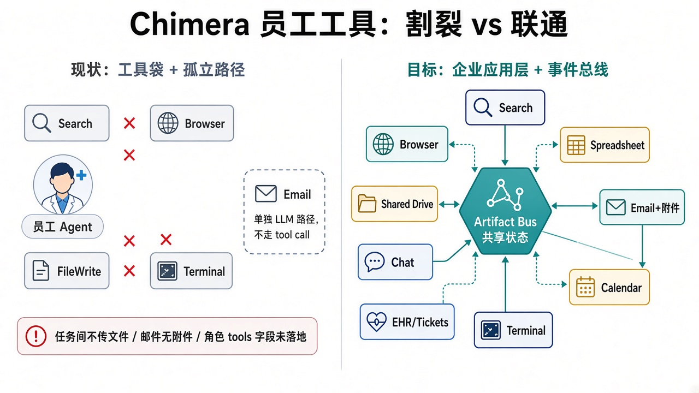
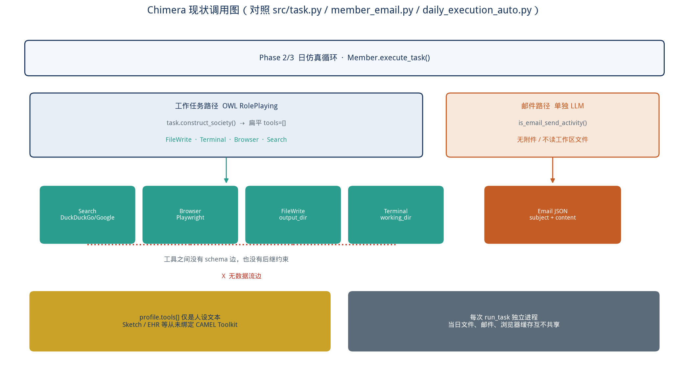
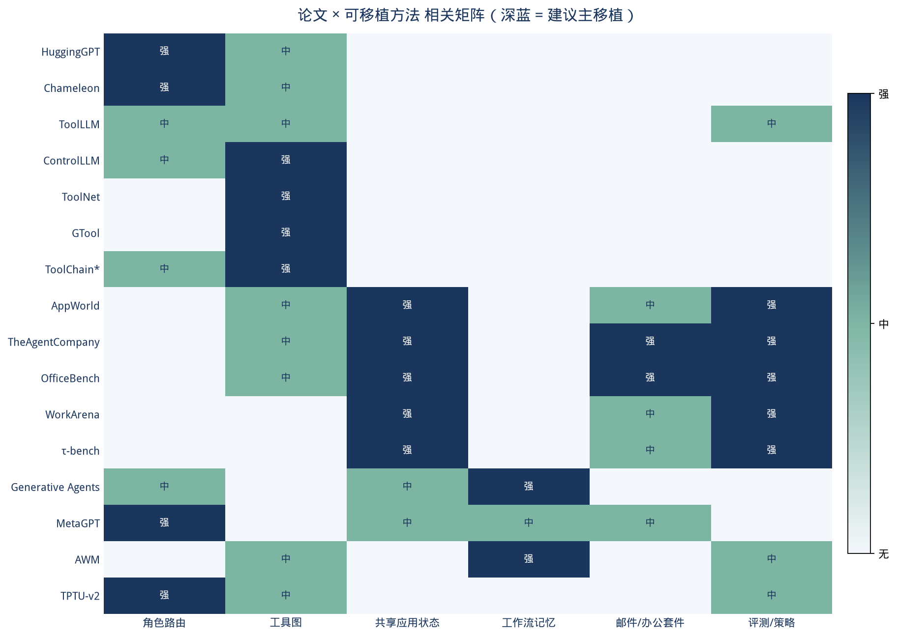
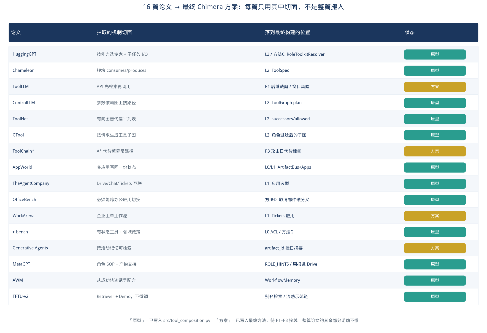
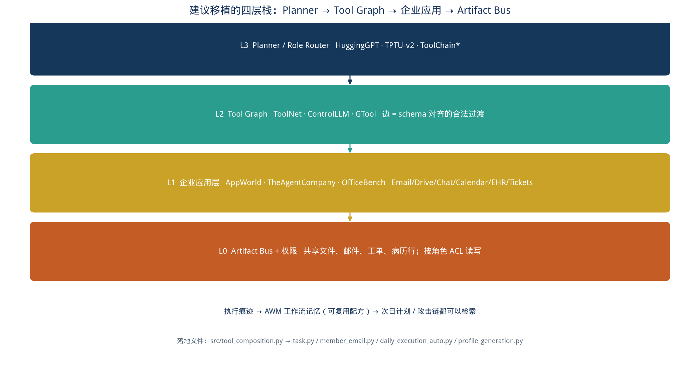
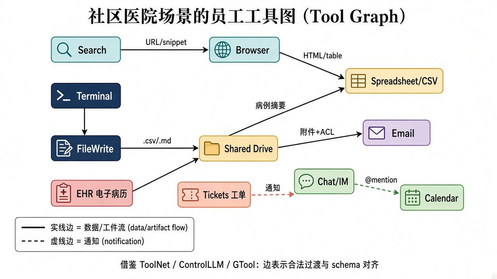
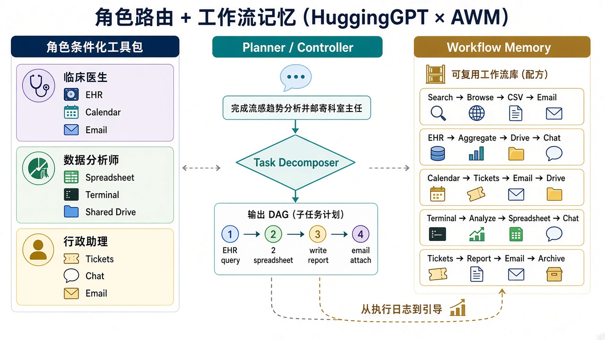
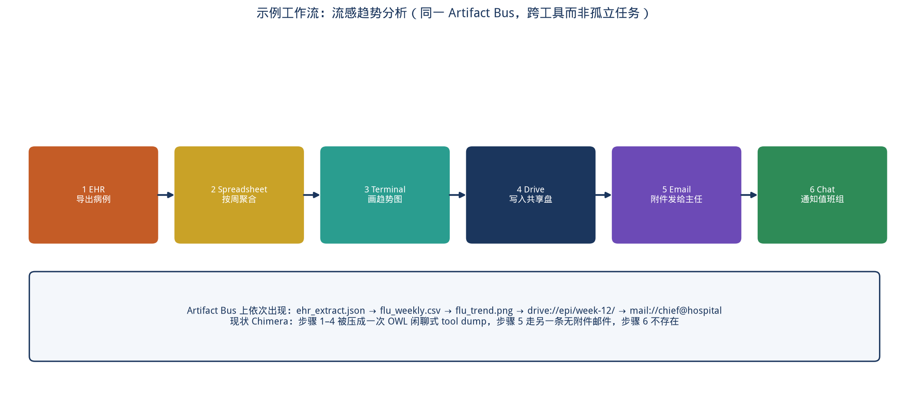
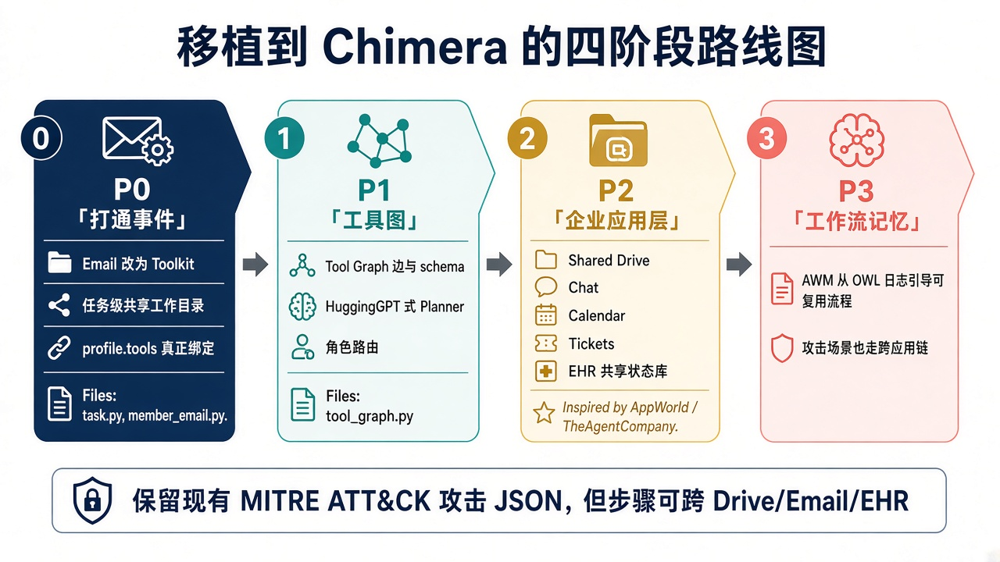

# Chimera 员工工具联通性调研：从「工具袋」到企业工作流

> 面向 NDSS 2026 Chimera 框架的方法移植说明。最终修改方法**不是 16 篇论文的并列综述，而是从每篇只抽取可落地的机制切面再组合**：L0 Artifact Bus、L1 企业应用、L2 Tool Graph、L3 角色路由。下文第 4 节逐篇标明「用了什么 / 落到哪 / 明确没搬什么」。
>
> 文档版本：2026-09-18　|　工作分支：`cursor/tool-composition-research-c01a`　|　原型：`src/tool_composition.py`

---

## 1. 结论先行

Chimera 当前把员工能力做成了**扁平工具列表 + 一条完全独立的邮件 LLM 路径**。这与真实医院 / 企业办公相反：真实员工几乎从不「只用搜索」或「只用终端」，而是 `EHR → 表格 → 共享盘 → 带附件邮件 → 值班群通知` 这样的**跨应用链路**。

建议按四层栈移植，而不是继续往 `task.py` 里追加 Toolkit。四层分别来自不同论文的**切面**（详见第 4 节），而不是任何一篇的完整系统：

| 层 | 作用 | 切面来自 | Chimera 落点 |
| --- | --- | --- | --- |
| L3 Planner / 角色路由 | 按角色和任务分解子目标 | HuggingGPT 的 tool selection；MetaGPT 的角色 SOP；TPTU-v2 的 Retriever（**不用**其微调器） | `task.construct_society`、`profile_generation.py`、`RoleToolkitResolver` |
| L2 Tool Graph | 用有向边约束「谁能接到谁」 | ToolNet 的图导航；ControlLLM 的参数依赖图；Chameleon 的模块 I/O；GTool 的请求子图 | `ToolGraph` / `ToolSpec` |
| L1 企业应用层 | Email / Drive / Chat / Calendar / EHR / Tickets 是**有状态的应用** | AppWorld 多应用；TheAgentCompany 的 Drive/Chat/Tickets 选型；OfficeBench 的跨应用切换；WorkArena 的工单 | 扩工具，替换 `member_email.py` 的旁路 |
| L0 Artifact Bus | 文件、附件、病历行、工单在工具间传递 | AppWorld 共享库；τ-bench 有状态工具 + ACL | 日仿真工作区 + `Artifact.acl` |

本仓库已落地可单测的 L0–L2 原型（**尚未接入日仿真主循环**，避免打断现有 Phase 2/3）。流感周报链路的单测证明：邮件可以带上共享盘附件，聊天可以引用这封邮件。



---

## 2. 现状诊断：割裂具体出在哪

对照代码，割裂不是「工具太少」这么简单，而是**三条互不相通的世界**：



### 2.1 工作任务：OWL 拿到的是工具袋

`src/task.py` 的 `construct_society()` 把 FileWrite / Terminal / Browser / Search 一次性塞进 `assistant_agent_kwargs["tools"]`。模型看到的是一份无序清单，没有：

- 工具之间的合法后继（Search 的产出应是 URL，Browser 才消费 URL）
- 产物类型（csv、png、docx）
- 与下一任务、下一员工的交接物

这正是 ToolNet 批评的范式：*“simply format tools into a list of plain text descriptions … ignores the intrinsic dependency between tools”*。

### 2.2 邮件：另一条单次 LLM，读不到工作区

`daily_execution_auto.py` 里 `is_email_send_activity()` 为真时走 `Member.send_email()` → `member_email.py` 的两次 `run_llm`。邮件只有 `subject` / `content`，**不能附上刚才 FileWrite 写出来的流感表**。生产环境里「写完报告再发邮件」是同一件事，Chimera 里是两个互不认识的子系统。

### 2.3 角色 tools 字段是人设，不是绑定

`profile_generation.py` 会生成 `"tools": ["Sketch", "ComponentLibraryToolkit", ...]`，以及 `application.Zendo` 这种账号。这些字符串**从不进入** `construct_society()`。设计师和流行病学家拿到的是同一套 Search+Browser+FileWrite+Terminal。

### 2.4 任务进程互相隔离

每次 `run_task` 在独立进程里跑，`output_dir` 虽按成员划分，但：

- 浏览器缓存、终端产物、邮件、次日计划之间没有对象层
- 长期记忆只有 `daily_summary_*.json` 的自然语言，没有可被下一工具打开的 artifact
- 内部威胁步骤（`attacks/*.json`）同样无法表达「先从 EHR 导出再经共享盘外发」

所以即使用更多 CAMEL Toolkit（代码里已注释掉 Image / Video / CodeExecution），只要仍是扁平列表，割裂不会消失。

---

## 3. 调研范围与筛选标准

检索来源：arXiv / Hugging Face Papers / ACL Anthology / ICLR / NeurIPS Datasets & Benchmarks。筛选条件：

1. **必须处理多工具或多应用**，而不是单 API 调用；
2. 方法能在 **不重新训练基础模型** 的前提下接到 Chimera 的 OWL RolePlaying / Camel ChatAgent；
3. 对内部威胁仿真有加成：共享状态、权限、跨应用痕迹。

下面 16 篇均满足至少两条。第 4 节是**构建溯源**（每篇用了哪一刀）；相关矩阵只表示主题相关，不表示整篇被实现。



---

## 4. 最终构建用了每篇论文的哪些内容

是的：最终方案是 16 篇论文的**机制切面组合**。读取约定：

- **抽取**：论文里真正被采用的那一条机制（通常只有 1–2 个构件）。
- **落到最终构建**：Chimera 四层栈 / 方法 A–G / `src/tool_composition.py` 中的符号。
- **状态**：「原型」= 已编码；「方案」= 已写入本文件的方法与路线图，尚未接线到日仿真。
- **明确未采用**：同篇论文里故意没搬的部分，避免误读成「复现了整篇系统」。



### 4.1 总表（论文 → 切面 → 落点）

| # | 论文 | 抽取的具体内容 | 落到最终构建的位置 | 状态 | 明确未采用 |
| --- | --- | --- | --- | --- | --- |
| 1 | HuggingGPT | ① 按能力选择专家而不是一次加载全部模型；② 子任务之间用显式 I/O 相连（plan → select → execute） | L3 角色路由；`RoleToolkitResolver` 按 `role`/`tools` 选 toolkit；流感周报作为「先分解再执行」的示范任务 | 原型（选择器）；完整 LLM Planner 为 P1 | Hugging Face 上的专家模型调度、多模态模型仓库、原论文四阶段 prompt |
| 2 | Chameleon | 把工具做成即插即用**模块**，每个模块声明输入/输出，组合时只拼模块序列 | `ToolSpec.consumes` / `produces`；`WORKPLACE_TOOLS` 的模块化清单 | 原型 | 原论文的知识库/视觉/程序模块库存、Chameleon 原 planner |
| 3 | ToolLLM | 大规模 API **不能**全部塞进 prompt；必须先检索再调用 | 风险节的窗口约束；P1「每轮只暴露后继」；与 TPTU Retriever 合流 | 方案 | ToolBench 数据、DFSDT 树搜索、16k API、模型微调 |
| 4 | ControlLLM | Thoughts-on-Graph：先建**参数依赖图**，在图上搜路径，再交给执行引擎 | `ToolGraph` 边由 schema 对齐自动生成；`ToolGraph.plan()` 从起点搜到目标产物类型 | 原型（BFS，不是完整 ToG） | 多模态工具箱、跨设备执行引擎、原论文 ToG 搜索细节 |
| 5 | ToolNet | 批评扁平工具列表忽略依赖；节点=工具、边=合法转移；每步只在**当前后继**里选；失败可调边权 | 问题定义（§2.1 直接引用其批评）；`successors()` / `allowed()`；P1 OWL 只注册后继 | 原型（图+后继）；在线边权为 P1 | 千级工具扩展、在线边权更新实验 |
| 6 | GTool | 静态全图对所有请求不合适；应按**当前请求**构图 | `RoleToolkitResolver`：行政助理子图无 EHR 边，流行病学家有；「角色+任务 = 请求」 | 原型（角色子图） | 缺边预测网络、GNN、7B 微调 |
| 7 | ToolChain\* | 把 API 调用做成决策树，用 A\* 代价剪掉高成本分支 | 路线图 P3：攻击日给「异常外发」标高代价，作为检测标签 | 方案 | 真正的 A\* 实现、原论文启发式 |
| 8 | AppWorld | ① 多个应用写**同一份关系状态**；② 评测看终态不看死板 API 序列；③ 应用 API 彼此可见 | L0 `ArtifactBus`；L1 `WorkplaceApps`（EHR/表格/Drive/Email/Chat 写同一 bus）；`flu_trend_demo` 断言附件与引用这些**终态** | 原型 | 457 个 API、106 人世界、交互式写代码 agent、MCP server |
| 9 | TheAgentCompany | 真实职场 = 文档盘 + 聊天 + 工单/项目（OwnCloud / RocketChat / Plane）互联，而不是搜索+终端 | L1 应用选型：Shared Drive、Chat、Tickets 对应这三件；问题定义「生产环境不割裂」 | 原型（内存应用形状） | 自托管 GitLab/OwnCloud Docker、浏览器 UI agent、其任务集 |
| 10 | OfficeBench | 办公任务必须在 Word/Excel/Calendar/Email 间**切换**；失败模式就是不会跨应用 | 方法 D：取消「工作任务 vs 邮件」硬分叉；流感链路里 spreadsheet 与 email 同一次状态机 | 原型（跨应用 demo） | 真实 Word/Excel GUI、办公 Docker 镜像 |
| 11 | WorkArena | 知识员工在企业 SaaS（ServiceNow）上走**工单工作流** | 方法 E 的 Tickets 应用；内部威胁「假工单提权」 | 方案（规格已写入，API 未实现） | ServiceNow 远程环境、BrowserGym、其 29/33 条任务 |
| 12 | τ-bench | ① 工具有状态；② 附带 **domain policy**；③ 用终态一致性 / `pass^k` 评稳定性 | `Artifact.acl` 默认拒绝；email **禁止直接消费** raw `ehr_record`/`table`（必须先物化成文件/盘）；方法 G 政策文本；P3 `pass^k` | 原型（ACL+物化约束）；政策文本与 pass^k 为方案 | 模拟用户对话、零售/航空 API、原 benchmark 本身 |
| 13 | Generative Agents | 观察写入记忆流，后续计划能**检索**过去，而不是只留一段摘要 | 方法 A：`daily_summary` 同时挂 `artifact_ids`，第二天能打开昨天的 csv | 方案 | Smallville 沙盒、反思树、完整记忆流 runtime |
| 14 | MetaGPT | 角色有 SOP；角色之间交接的是**产物**（文档/代码），不是纯对话 | `ROLE_HINTS`；全员常驻 email/drive/file_write；P2 周会纪要写入 Drive | 原型（角色包）；周报进 Drive 为方案 | 软件瀑布 SOP、代码生成流水线、MetaGPT runtime |
| 15 | Agent Workflow Memory | 从成功轨迹诱导可复用 workflow，之后优先检索 recipe 再执行 | `WorkflowMemory.remember/suggest`；`EmployeeToolSession.plan_for` 先查记忆 | 原型（内存 recipe）；从 OWL 日志诱导为 P3 | Mind2Web/WebArena 网页动作空间、在线诱导全流程 |
| 16 | TPTU-v2 | 真实系统三个构件里只要 ① API Retriever ② Demo Selector；**不做** LLM Finetuner | 别名表 `PROFILE_TOOL_ALIASES` = 轻量检索；`flu_trend_demo` = 固定 demonstration 链 | 原型 | 论文中的微调器、商业系统 API 检索训练 |

### 4.2 反向索引（最终构件 → 论文切面）

| 最终构件 | 组合了哪些论文的哪一刀 |
| --- | --- |
| `ToolSpec` | Chameleon 的模块 I/O；ControlLLM 的参数依赖声明 |
| `ToolGraph.plan/successors` | ToolNet 的图导航；ControlLLM 的「先搜路径」；GTool 的子图（经角色过滤） |
| `RoleToolkitResolver` | HuggingGPT 的专家选择；MetaGPT 的角色；TPTU Retriever；GTool 请求子图 |
| `ArtifactBus` + `acl` | AppWorld 共享库；τ-bench 有状态 + 默认拒绝 |
| `WorkplaceApps` | AppWorld 多应用；TheAgentCompany Drive/Chat；OfficeBench 跨应用；EHR 为医院域替换 |
| `WorkflowMemory` | AWM 的 recipe 记忆 |
| 邮件必须带附件对象 | OfficeBench 跨应用；AppWorld 状态传递；τ-bench 政策（禁止裸发 EHR） |
| Tickets 应用 | WorkArena 工单；TheAgentCompany Plane |
| P3 攻击代价 / 偏离 recipe | ToolChain\* 的代价剪枝；AWM 的常用配方作对照 |

下面第 5 节按论文展开。若只需要「每篇用了什么」，读完 §4.1 即可。

---

## 5. 相关论文（16 篇，逐篇切面）

每篇固定四段：**论文在做什么** / **和 Chimera 的错位** / **最终构建抽取了哪一刀** / **明确没搬什么**。

### 5.1 HuggingGPT — 控制器分解任务并路由专家工具

- Shen et al., *HuggingGPT: Solving AI Tasks with ChatGPT and its Friends in Hugging Face*, NeurIPS 2023. [arXiv:2303.17580](https://arxiv.org/abs/2303.17580)　[HF](https://huggingface.co/papers/2303.17580)
- **论文在做什么**：LLM 做 task planning → model selection → execution → response，子任务 I/O 显式相连。
- **错位**：Chimera 没有 Planner，OWL assistant 自己在工具袋里摸索。
- **最终构建抽取**：只取「按能力选专家」和「子任务要有 I/O」。落成 `RoleToolkitResolver`（临床 vs 行政拿到不同 toolkit），以及把流感周报当成一条有 I/O 的示范分解。
- **未采用**：Hugging Face 模型路由、多模态专家、原论文四阶段完整 Planner（P1 再接到 `construct_society` 之前）。

### 5.2 Chameleon — 即插即用的组合推理

- Lu et al., *Chameleon: Plug-and-Play Compositional Reasoning with Large Language Models*, 2023. [arXiv:2304.09842](https://arxiv.org/abs/2304.09842)　[HF](https://huggingface.co/papers/2304.09842)
- **论文在做什么**：知识检索、视觉、程序、表格等做成模块，LLM 生成模块序列。
- **最终构建抽取**：模块要声明输入输出。落成 `ToolSpec(name, consumes, produces)` 和 `WORKPLACE_TOOLS`。
- **未采用**：原论文模块库存（维基、视觉等）和它的 planner prompt。

### 5.3 ToolLLM — 大规模 API 与规划，而不是 4 个工具

- Qin et al., *ToolLLM: Facilitating Large Language Models to Master 16000+ Real-world APIs*, ICLR 2024. [arXiv:2307.16789](https://arxiv.org/abs/2307.16789)
- **论文在做什么**：ToolBench + DFSDT；先检索再调用。
- **最终构建抽取**：只取「工具一多就不能全塞 prompt」。落成 P1 后继裁剪，以及 `message_window_size = 12` 的风险约束。
- **未采用**：DFSDT、ToolBench、16000 API、任何微调。

### 5.4 ControlLLM — 在工具图上搜路径（Thoughts-on-Graph）

- Liu et al., *ControlLLM: Augment Language Models with Tools by Searching on Graphs*, 2023. [arXiv:2310.17796](https://arxiv.org/abs/2310.17796)
- **论文在做什么**：任务分解 + 参数依赖图 + 图搜索 + 执行引擎。
- **最终构建抽取**：参数依赖图和「先搜路径再执行」。落成 schema 对齐自动建边，以及 `ToolGraph.plan(start_tools, goal_type)`（实现为 BFS）。
- **未采用**：原论文 ToG 算法细节、多模态工具、跨设备调度。

### 5.5 ToolNet — 用有向图替代扁平列表

- Liu et al., *ToolNet: Connecting Large Language Models with Massive Tools via Tool Graph*, 2024. [arXiv:2403.00839](https://arxiv.org/abs/2403.00839)
- **论文在做什么**：扁平列表忽略依赖；有向图上逐步走后继；边权可更新。
- **最终构建抽取**：① 对扁平 `tools=[]` 的批评直接用于 §2.1；② 后继约束 `successors`/`allowed`（所以 `search→ehr` 非法）；③ P1 每轮只暴露后继以省 token。
- **未采用**：在线边权、千级工具库。

### 5.6 GTool — 请求相关的工具图 + 补边

- Chen et al., *GTool: Graph Enhanced Tool Planning with Large Language Model*, 2025. [arXiv:2508.12725](https://arxiv.org/abs/2508.12725)
- **论文在做什么**：静态全图不够；按请求构图；预测缺失依赖。
- **最终构建抽取**：按请求（在 Chimera 里 = 角色 + 任务）生成子图。落成流行病学家有 EHR 边、行政助理没有。
- **未采用**：缺边预测模型、GNN、7B 训练。

### 5.7 ToolChain\* — 在工具动作树上做 A\*

- Zhuang et al., *ToolChain\*: Efficient Action Space Navigation in Large Language Models with A\* Search*, ICLR 2024. [arXiv:2310.13227](https://arxiv.org/abs/2310.13227)
- **论文在做什么**：API 调用决策树 + A\* 代价剪枝。
- **最终构建抽取**：只取「动作用代价区分」这一思想。留给 P3 攻击日：正常路径低代价，异常外发高代价，供检测当标签。
- **未采用**：A\* 代码、原论文启发式（当前原型的 `plan()` 只是 BFS）。

### 5.8 AppWorld — 多应用、共享数据库、状态评测

- Trivedi et al., *AppWorld: A Controllable World of Apps and People for Benchmarking Interactive Coding Agents*, ACL 2024 Best Resource Paper. [arXiv:2407.18901](https://arxiv.org/abs/2407.18901)　[项目](https://appworld.dev/)
- **论文在做什么**：9 应用、457 API、共享关系库、状态单元测试。
- **最终构建抽取**：① 多应用写同一状态 → `ArtifactBus` + `WorkplaceApps`；② 评测终态 → `flu_trend_demo` 查附件数和 chat 引用，而不是查「是否按固定 API 顺序」。
- **未采用**：完整 AppWorld 引擎、457 API、MCP 服务、编码式 agent。

### 5.9 TheAgentCompany — 仿真软件公司内网

- Xu et al., *TheAgentCompany: Benchmarking LLM Agents on Consequential Real World Tasks*, 2024（NeurIPS 2025 D&B）. [arXiv:2412.14161](https://arxiv.org/abs/2412.14161)　[站点](https://the-agent-company.com)
- **论文在做什么**：GitLab + OwnCloud + RocketChat + Plane 的自托管公司。
- **最终构建抽取**：应用清单的职场对应关系——Drive←OwnCloud、Chat←RocketChat、Tickets←Plane。GitLab 明确不搬（与 sysdig 容器叠加过重）。
- **未采用**：四件套 Docker、其浏览器 agent、评测任务。

### 5.10 OfficeBench — 办公套件来回切换

- Wang et al., *OfficeBench: Benchmarking Language Agents across Multiple Applications for Office Automation*, 2024. [arXiv:2407.19056](https://arxiv.org/abs/2407.19056)
- **论文在做什么**：Word / Excel / Calendar / Email 同环境；主要失败是不会切换应用。
- **最终构建抽取**：跨应用切换。落成方法 D（邮件不再是旁路）和流感 demo 里表格→盘→邮件同一次 `WorkplaceApps` 会话。
- **未采用**：真实 Office GUI。

### 5.11 WorkArena — 企业 SaaS 工作流（ServiceNow）

- Drouin et al., *WorkArena: How Capable Are Web Agents at Solving Common Knowledge Work Tasks?*, 2024. [arXiv:2403.07718](https://arxiv.org/abs/2403.07718)
- **论文在做什么**：ServiceNow 上的知识员工任务 + BrowserGym。
- **最终构建抽取**：工单作为一种一等应用。落成方法 E 的 Tickets 行，以及内部威胁「假工单提权」。`WORKPLACE_TOOLS` 已有 `tickets` 节点，应用 API 尚未实现。
- **未采用**：ServiceNow、BrowserGym、原任务集。

### 5.12 τ-bench — 有状态工具 + 领域政策

- Yao et al., *τ-bench: A Benchmark for Tool-Agent-User Interaction in Real-World Domains*, 2024. [arXiv:2406.12045](https://arxiv.org/abs/2406.12045)
- **论文在做什么**：领域 API + policy；数据库终态；`pass^k`。
- **最终构建抽取**：① 有状态 → Bus；② policy → EHR 默认仅 owner 可见，email 不接受裸 `ehr_record`/`table`；③ `pass^k` 留给 P3。
- **未采用**：模拟用户、零售/航空域、原基准。

### 5.13 Generative Agents — 跨活动记忆

- Park et al., *Generative Agents: Interactive Simulacra of Human Behavior*, UIST 2023. [arXiv:2304.03442](https://arxiv.org/abs/2304.03442)
- **论文在做什么**：观察 → 记忆流 → 检索 → 反思 → 计划。
- **错位**：Chimera 已有 `daily_summary`，但是纯文本。
- **最终构建抽取**：记忆条目必须能打开。落成方法 A「摘要挂 `artifact_id`」，尚未改 `daily_execution_auto.py`。
- **未采用**：Smallville、反思树。

### 5.14 MetaGPT — SOP 与角色间共享产物

- Hong et al., *MetaGPT: Meta Programming for A Multi-Agent Collaborative Framework*, ICLR 2024. [arXiv:2308.00352](https://arxiv.org/abs/2308.00352)
- **论文在做什么**：标准化 SOP，角色交接产物。
- **最终构建抽取**：角色差异 + 产物交接。落成 `ROLE_HINTS`、协作核心常驻；P2 把周会纪要写成 Drive 对象，从而把 Phase 1 接到 Phase 2。
- **未采用**：软件工程瀑布、代码流水线。

### 5.15 Agent Workflow Memory — 从轨迹里诱导可复用配方

- Wang et al., *Agent Workflow Memory*, 2024. [arXiv:2409.07429](https://arxiv.org/abs/2409.07429)
- **论文在做什么**：从成功轨迹抽 workflow，之后检索来指导动作。
- **最终构建抽取**：recipe 记忆。落成 `WorkflowMemory` 与 `plan_for()` 的「先查配方」。从 OWL 日志自动诱导留给 P3。
- **未采用**：网页导航动作空间、在线诱导实验协议。

### 5.16 TPTU-v2 — 真实系统里的检索 / 微调 / 示例选择

- Kong, Ruan et al., *TPTU-v2: Boosting Task Planning and Tool Usage of Large Language Model-based Agents in Real-world Systems*, 2023. [arXiv:2311.11315](https://arxiv.org/abs/2311.11315)
- **论文在做什么**：API Retriever + LLM Finetuner + Demo Selector 三件套。
- **最终构建抽取**：只要 Retriever 和 Demo，**明确丢掉 Finetuner**。别名表 = 检索；`flu_trend_demo` = 示范链。
- **未采用**：任何基座微调、商业 API 检索器训练。

---

## 6. 希望集成到 Chimera 的具体方法



### 方法 A — Artifact Bus（先做，改动面最小，收益最大）

**用了哪些论文的哪一刀**：AppWorld 的「多应用写同一关系库」；τ-bench 的有状态工具与默认拒绝 ACL；Generative Agents 的「记忆必须可检索」（摘要挂 `artifact_id`，尚未改日循环）。**没用** TheAgentCompany 的真实 OwnCloud。

**做法**：公司级对象存储，键为 `artifact_id`，值为类型、生产者、owner、ACL、payload。所有工具只通过 Bus 读写。

**接到现有代码**：

- `Member.temp_dir` / `output_dir` 继续存字节，但写完必须 `bus.put(...)`
- `send_email` 增加 `attachment_ids`，从 Bus 取 Drive / File 对象
- `daily_summary` 除自然语言外写 `artifact_ids: [...]`
- 攻击步骤的 `observable_evidence` 指向具体 artifact（例如 `drive://epi/week-12/flu.csv` 被拷到个人盘）

原型：`ArtifactBus`、`WorkplaceApps.send_email(..., attachment_ids=...)`。

### 方法 B — Tool Graph 替代扁平 `tools=[]`

**用了哪些论文的哪一刀**：ToolNet 的有向后继（及对扁平列表的批评）；ControlLLM 的参数依赖图 + 先搜路径；Chameleon 的模块 I/O；GTool 的角色/请求子图。**没用** ToolNet 在线边权、ControlLLM 完整 ToG、ToolChain\* 的 A\*（A\* 只出现在方法/P3）。

**做法**：每个工具声明 `consumes` / `produces`。边由 schema 对齐自动生成。OWL 每轮只注册后继工具（或全量注册但在 system prompt 里给出邻接表 + 禁止跳边）。

医院场景的目标图：



**接到 `task.py`**：`construct_society(question, output_dir, tools=session.tools)`，不要写死四件套。`offline_mode` 仍可关掉 Browser/Search，但 Email/Drive/EHR 应保留（它们是本地状态，不依赖外网）。

原型已覆盖：`search→browser` 合法，`search→ehr` 非法；从 `ehr` 规划到 `email` 会经过表格/共享盘。

### 方法 C — 角色路由，让 `profile.tools` 真正落地

**用了哪些论文的哪一刀**：HuggingGPT 的「按能力选专家」；MetaGPT 的角色 SOP；TPTU-v2 的 Retriever（别名表）——**明确不用**其 Finetuner。

**做法**：

1. 维护别名表：`Sketch → file_write`，`Excel → spreadsheet`，`Epic/EHR → ehr`，`Slack/RocketChat → chat`（见 `PROFILE_TOOL_ALIASES`）
2. `RoleToolkitResolver.resolve(profile)` 按 `role` 关键字 + 别名绑定
3. 协作核心（email / shared_drive / file_write）**所有人常驻**，避免再次把邮件变成特权旁路



流行病学家应拿到 EHR+表格+终端；行政助理拿日历+工单+邮件，默认**没有** EHR。这同时提高正常行为区分度，并让「越权读病历」成为可执行的攻击步骤而不是 prompt 里的一句戏。

### 方法 D — 把邮件（以及聊天、日历）收回 Toolkit

**用了哪些论文的哪一刀**：OfficeBench 的「必须能跨办公应用切换」；TheAgentCompany 的 RocketChat 形状；AppWorld 的消息应用写共享状态。

**做法**：删除「邮件活动 / 工作活动」的硬分叉，或保留分叉但邮件函数必须能读 Bus。一次 RolePlaying 允许：

`spreadsheet.aggregate → shared_drive.save → email.send(attach=...) → chat.notify`

`member_email.py` 可以继续用 LLM 写语气，但 **to / attachments / thread_id** 必须是结构化工具参数，否则永远没有附件和引用。

### 方法 E — 企业应用层（适度扩工具）

**用了哪些论文的哪一刀**：AppWorld 的多应用设定；TheAgentCompany 的 Drive/Chat/Tickets 选型（不用 GitLab）；WorkArena 的工单工作流（只用规格，不上 ServiceNow）；医院域用 EHR 替换其软件仓。

建议新增的**有状态应用**（优先内存实现，不必先上真实 GitLab）：

| 应用 | 关键 API | 谁用 | 内部威胁语义 |
| --- | --- | --- | --- |
| Shared Drive | `save / share / copy / acl` | 全员 | 批量下载、权限扩散、投递点 |
| Email | `send / reply / attach / forward` | 全员 | 外发、钓鱼、附件泄露 |
| Chat | `post / dm / mention` | 全员 | 社工、值班口令、横向沟通 |
| Calendar | `create / invite` | 行政、临床 | 异常时段、掩护窗口 |
| Tickets | `open / comment / close / assign` | IT、护理 | 假工单提权 |
| EHR | `query / export / audit` | 临床、流行病 | 越权查询、批量导出 |
| Spreadsheet | `aggregate / join / plot` | 数据、流行病 | 把导出变成可外发报表 |
| Terminal | 现有 | 开发 / 数据 | 与 Drive 互通，而不是写完就丢 |

搜索和浏览器保留，但它们是 **L2 图上的入口节点**，不是唯一能力。

### 方法 F — Workflow Memory

**用了哪些论文的哪一刀**：AWM 的「从成功轨迹诱导 recipe，执行时先检索」。**没用**其网页导航实验协议。从 OWL 日志自动诱导仍是 P3。

**做法**：从现有 OWL 日志解析 tool-call 序列，聚类成 recipe。Planner 先检索 recipe 再执行。原型里 `WorkflowMemory.remember / suggest` 已能复用 `ehr→spreadsheet→email`。

### 方法 G — 领域 Policy 挂在工具上

**用了哪些论文的哪一刀**：τ-bench 的 domain policy + 终态一致性；P3 才用它的 `pass^k`。ToolChain\* 只贡献「用代价标记异常路径」的标签思想，不实现 A\*。

**做法**：每个应用带一份短政策，例如 EHR：`不得把 identifiability 字段写入可被 * ACL 看到的 Drive`。正常员工的 Planner 被政策约束；攻击脚本显式 `violate_policy=true`。日志里同时有 MITRE 标签和 **policy-id**，检测研究更干净。

---

## 7. 一条应能跑通的黄金路径

默认场景是社区医院流感分析（`config.company_type` / `config.goal`）。真实员工不会「打开终端随便敲」，而会走：



原型 `flu_trend_demo()` 已经在单测里跑通对应状态变化：

1. `ehr_export` → `ehr_record`
2. `aggregate_table` → `table`
3. `save_drive` → 全员可见的 `drive_object`
4. `send_email` 把 Drive 对象列为附件（`attachment_count ≥ 1`）
5. `notify_chat` 引用该邮件 id

这就是「工具有联系」的最小可执行定义：**后一步的输入是前一步的对象，而不是再编一段自然语言。**

---

## 8. 代码怎么接（按文件）

不建议一上来改 OWL 内核。按依赖从里到外：

| 文件 | 改什么 |
| --- | --- |
| `src/tool_composition.py` | **已加** Bus / Graph / Resolver / Apps / Memory |
| `src/task.py` | `construct_society` 接收 `EmployeeToolSession`；工具列表来自 `session.allowed_names()`；FileWrite/Terminal 的目录与 Bus 对齐 |
| `src/member_email.py` | `get_email_content` 增加可选 `attachment_ids`；或降级为 Email toolkit 的文案生成器 |
| `src/activity_utils.py` | 邮件不再独占一条执行路径，或「邮件活动」仍走工具会话 |
| `src/daily_execution_auto.py` | `Member` 持有 `bus` 引用（进程间用 JSONL/SQLite）；`execute_task` 把 session 传进 `run_task` |
| `src/daily_execution_auto_attack.py` | 攻击步骤可声明 `tools` 与 `artifacts` |
| `src/profile_generation.py` | 示例 tools 改成可解析别名；生成后校验 `RoleToolkitResolver` 非空 |
| `src/post_meeting_summary_auto.py` | 周目标同时写入 Drive 对象 |
| `attacks/*.json` | `how[].procedure` 增加 `artifact_flow` 字段（非破坏性扩展） |

进程模型注意：现在 `run_task_in_process` 是 **multiprocessing**。Bus 必须是跨进程存储（SQLite / JSONL 在 `execution_log_dir`），不能只放父进程内存。原型里的 `ArtifactBus` 是单测用内存版，接入日仿真时换成文件后端即可，接口不用改。

---

## 9. 分阶段路线图



**P0 打通事件（推荐下一 PR）**

- Email 可挂附件（哪怕先只附 `output_dir` 里最新文件）
- 同一成员当天的 FileWrite 目录对后续任务可见
- `profile.tools` 经别名表绑定，不再是死字符串

**P1 工具图 + 角色路由**

- 把 `src/tool_composition.py` 接入 `task.py`
- OWL 提示词加入邻接表；可选：每轮只暴露后继
- 单测保持绿，再开小规模 Phase 2（1 天、少量员工）看日志里是否出现跨工具链

**P2 企业应用层**

- Drive / Chat / Calendar / Tickets / EHR 的 JSON 后端
- 周会产物进 Drive
- 攻击 JSON 增加 `artifact_flow`

**P3 工作流记忆与政策**

- 从执行日志诱导 recipe
- τ-bench 风格 policy + `pass^k` 稳定性（同一工作流跑 k 次，产物 schema 是否稳定）
- 用跨应用 traces 重新评估内部威胁检测基线，回答「更真实的正常行为是否让旧检测器失效」

---

## 10. 对内部威胁仿真意味着什么

联通工具不是为了让 agent 更强，而是为了让 **CERT 风格日志长得像真的**：

- 正常：EHR 小查询 → 聚合表 → 内部盘 → 内部邮件附件 → 值班群
- 泄露：EHR 大查询 → 个人盘 / USB 路径（Terminal）→ 私人邮箱转发
- 提权：假工单 → 日历掩护 → 共享盘 ACL 被改
- 破坏：Tickets 关闭监控 → Terminal 清日志（仍应留下 Bus 上的审计对象）

没有共享状态时，攻击步骤只能是自然语言「exfiltrate files」，sysdig/pcap 里看不到一条可解释的应用层因果链。有了 Bus，检测特征可以从「调了 Terminal」升级到「EHR 导出行数 vs 历史 recipe 的偏离 + 附件发往域外」。

---

## 11. 风险与非目标

- **Token 与延迟**：ToolNet 的本意是减少工具描述占用。P1 应用后继裁剪，不要把 8 个应用的全部 API 一次性塞进 12 条消息窗口（`message_window_size = 12` 已经很紧）。
- **不要一上来 docker 化 GitLab**：TheAgentCompany 的环境很重，和 Chimera 已有的 sysdig 容器叠加会极难复现。先 JSON 应用层。
- **不要为了联通而联通外网**：`offline_mode` 应仍能跑 Drive/Email/EHR；只有 Search/Browser 依赖外网。
- **权限必须默认拒绝**：否则「全员 `acl=*`」会让泄露场景失真。EHR 默认仅 owner 可见，显式 share 才扩散。
- **本 PR 不修改日仿真主循环**，避免在无充分回归时改变 NDSS 实验路径。

---

## 12. 原型如何验证

```bash
PYTHONPATH=src python3 -m unittest tests.test_tool_composition
```

覆盖：图约束、角色绑定（含 Sketch 别名）、EHR ACL、流感链路附件、AWM recipe 复用。

接入主循环前，建议再加：用一份真实 `generated_members/*.jsonc` 跑 `RoleToolkitResolver`，统计每类角色的工具集合，防止全部塌缩成同一套。

---

## 13. 飞书云文档

本文件即飞书导入源稿（Markdown + 图）。

**无需开放平台权限（手动）**

1. 打开飞书 → 云文档 → 「导入」
2. 选择 `docs/feishu/chimera-tool-composition.html`（图已内嵌，不会丢）
3. 或直接导入本 Markdown，再把 `docs/assets/` 下的 png 拖进对应段落

**有开放平台权限（自动）**

创建企业自建应用，开通云文档导入 / 云空间权限，然后：

```bash
export FEISHU_APP_ID=cli_xxx
export FEISHU_APP_SECRET=xxx
export FEISHU_FOLDER_TOKEN=可选的文件夹 token
python scripts/build_feishu_doc.py --publish
```

脚本会申请 `tenant_access_token`，按[导入文件概述](https://open.feishu.cn/document/server-docs/docs/drive-v1/import_task/import-user-guide)上传 HTML 并创建 `docx` 导入任务，成功后打印云文档 URL。

本环境未配置飞书应用凭证，因此仓库内交付物是：**Markdown 源稿 + 内嵌图 HTML + 一键发布脚本**。拿到 `FEISHU_APP_ID` / `FEISHU_APP_SECRET` 后在同一分支执行 `--publish` 即可生成真正的飞书云文档链接。

---

## 14. 参考文献（Bib 速查）

1. Shen et al. HuggingGPT. NeurIPS 2023. arXiv:2303.17580
2. Lu et al. Chameleon. 2023. arXiv:2304.09842
3. Qin et al. ToolLLM. ICLR 2024. arXiv:2307.16789
4. Liu et al. ControlLLM. 2023. arXiv:2310.17796
5. Liu et al. ToolNet. 2024. arXiv:2403.00839
6. Chen et al. GTool. 2025. arXiv:2508.12725
7. Zhuang et al. ToolChain*. ICLR 2024. arXiv:2310.13227
8. Trivedi et al. AppWorld. ACL 2024. arXiv:2407.18901
9. Xu et al. TheAgentCompany. 2024. arXiv:2412.14161
10. Wang et al. OfficeBench. 2024. arXiv:2407.19056
11. Drouin et al. WorkArena. 2024. arXiv:2403.07718
12. Yao et al. τ-bench. 2024. arXiv:2406.12045
13. Park et al. Generative Agents. UIST 2023. arXiv:2304.03442
14. Hong et al. MetaGPT. ICLR 2024. arXiv:2308.00352
15. Wang et al. Agent Workflow Memory. 2024. arXiv:2409.07429
16. Kong, Ruan et al. TPTU-v2. 2023. arXiv:2311.11315

补充（正文未单列但构成背景）：Yao et al. ReAct, ICLR 2023, arXiv:2210.03629；Cai et al. LATM, arXiv:2305.17126。
