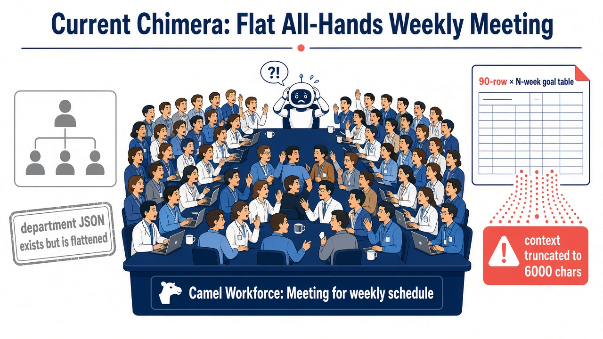
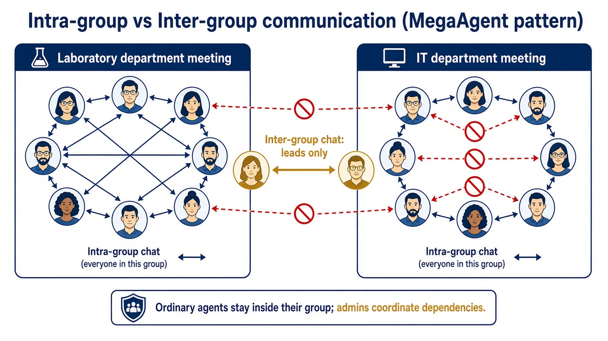
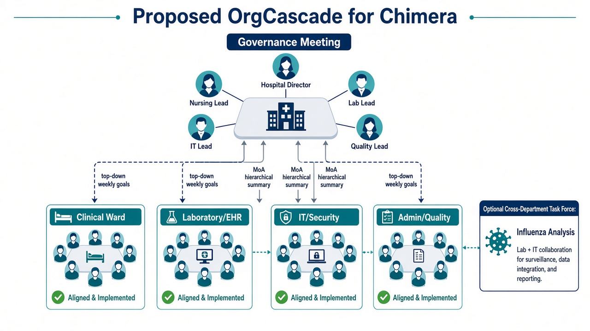
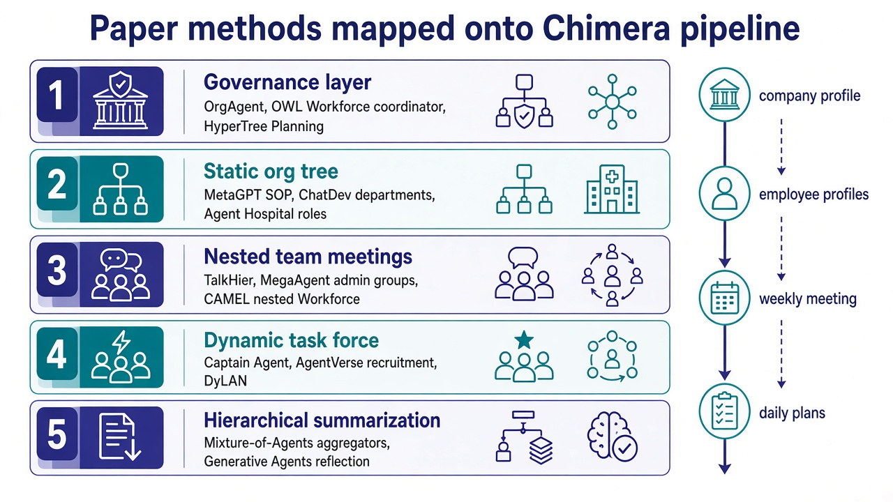

# Chimera 员工分组与级联日程：论文调研与可移植集成方案

> 调研结论先说：**不要再开一场全员周会。** Chimera 的公司画像 JSON 里其实已经有部门树，只是员工生成和周会编排把它拍平了。最适合移植进本框架的，不是再造一套多智能体操作系统，而是 **OrgCascade**：用静态组织树做常设科室，用嵌套 Workforce 做部门周会，用负责人通道做跨组协调，必要时再为跨科目标拉临时项目组。

本文面向把 `employee_number` 从个位数拉到几十、上百人后，仍用「全体员工开会定日程」会失效的问题。文中给出 12+ 篇可对照论文、一张映射到 Chimera 源码的集成蓝图，以及已经在工作分支上跑通的组织规划原型（90 人医院：**18 场会议，单场最多 10 人，0 场全员会**）。

---

## 1. 问题：员工是「一盘散沙」，周会却是「全体大会」

Chimera（NDSS 2026）用多智能体社会模拟一家机构的日常与内部威胁。Phase 1 的日程链是：

1. `company_profile_automation.py` 生成**嵌套**团队 JSON（`programming_team` / `design_team` / `support_teams` 等）
2. `profile_generation.py` 用 `extract_roles()` **递归拍平**所有 `roles`
3. `meeting_for_weekly_goal_auto.py` 把**每一位**员工加进同一个 Camel `Workforce`
4. `post_meeting_summary_auto.py` 试图从一场会的纪要里，给全部员工抽出当周目标（纪要还会被截到约 6000 字符）
5. `daily_plan_generation_auto.py` 再把周目标拆成每日日程

默认配置里 `employee_number = 90`、`period = 20`。5 人工作室时，「全员周会 → 每人一张周表」还能凑合；90 人社区医院再让检验科、护士站、EHR 工程师、安保坐在同一场 Camel Workforce 里争论下周目标，既不像真实组织，也会把上下文、token 和日志一起撑爆。



代码层面的「拍平」发生在这里：

```84:95:src/profile_generation.py
def extract_roles(data):
    roles = []
    if isinstance(data, dict):
        for key, value in data.items():
            if key == "roles" and isinstance(value, list):
                roles.extend(value)
            else:
                roles.extend(extract_roles(value))
```

```118:130:src/meeting_for_weekly_goal_auto.py
    for file in os.listdir(member_dir):
        if file.endswith(".jsonc"):
            ...
            workforce.add_single_agent_worker(member_description, worker=member_agent)
```

周会任务描述明确要求「每个员工、每一周」都写进一张大表，这是规模化后最不合理的约束。


---

## 2. 调研范围与筛选标准

检索来源：Hugging Face Papers API、arXiv HTML/PDF、ACL Anthology。筛选标准有三条，都直接服务 Chimera，而不是泛泛的「多智能体很火」：

| 标准 | 为什么重要 |
| --- | --- |
| **组织 / 分组 / 层级** | 对应「员工要分成小组」，而不是继续全员对话 |
| **可映射到现有流水线** | Chimera 已经依赖 Camel Workforce + OWL RolePlaying，优先能嵌进去的方法 |
| **身份要稳定** | 内部威胁模拟需要固定员工 ID、角色、工具权限；不能每回合随机招人换人 |

因此：**MetaGPT / ChatDev / Agent Hospital 的静态 SOP 组织**用来保身份；**TalkHier / MegaAgent / OWL Workforce 的层级协调**用来开会；**Captain Agent / AgentVerse / DyLAN** 只作为跨科临时项目组，不替代科室编制。

---

## 3. 相关论文（12+）

下列每篇都给出：核心机制、和 Chimera 的关系、建议吸收的那一块。链接同时给出 arXiv 与 Hugging Face Papers。

### 3.1 组织模板：先有科室，再有对话

#### P1. MetaGPT: Meta Programming for Multi-Agent Collaborative Framework

- **作者 / 年份**：Sirui Hong, Xiawu Zheng, Jonathan Chen 等，2023；ICLR 2024
- **链接**：https://arxiv.org/abs/2308.00352 · https://huggingface.co/papers/2308.00352
- **机制**：把软件公司 SOP 编码成固定角色（PM、架构师、工程师）和标准化工件流转，而不是让所有人在一个群里自由聊天。
- **可移植点**：Chimera 的 `team/*.json` 已经是 SOP 的胚胎。不要丢掉这棵树。给每个角色补上 `unit_path`、`is_lead`，周会按 SOP 规定的部门开，而不是按「所有 jsonc 文件」开。

#### P2. ChatDev: Communicative Agents for Software Development

- **作者 / 年份**：Chen Qian, Xin Cong, Cheng Yang 等，ACL 2024（arXiv 2307.07924）
- **链接**：https://arxiv.org/abs/2307.07924 · https://huggingface.co/papers/2307.07924
- **机制**：虚拟软件公司 + Chat Chain，把瀑布阶段拆成「谁和谁、谈什么」的短对话，而不是全员长对话。
- **可移植点**：把 Phase 1 的「一场周会」改成聊天链：`治理会 → 并行部门会 →（可选）跨科对齐`。每场会的 prompt 只覆盖本部门成员，对应 Chat Chain 的 phase 隔离。

#### P3. Agent Hospital: A Simulacrum of Hospital with Evolvable Medical Agents

- **作者 / 年份**：Junkai Li, Siyu Wang, Meng Zhang 等，2024
- **链接**：https://arxiv.org/abs/2405.02957 · https://huggingface.co/papers/2405.02957
- **机制**：医院模拟里医生 / 护士 / 患者是不同智能体群体，医疗流程按科室和职责走，而不是全院大会诊来决定每个人今天干什么。
- **可移植点**：Chimera 默认场景就是社区医院 + EHR / 流感分析。员工分组应按**临床、护理、检验、流病、信息、安保、行政**切，而不是按「有一个 role 字符串」切。日程是科室班次，不是全院共识。

#### P4. OrgAgent: Organize Your Multi-Agent System like a Company

- **作者 / 年份**：Yiru Wang, Xinyue Shen, Yaohui Han 等，2026
- **链接**：https://arxiv.org/abs/2604.01020 · https://huggingface.co/papers/2604.01020
- **机制**：把多智能体协作分成治理层（计划与资源）、执行层（做事与互评）、合规层（最终出口）。论文报告层级结构相对扁平协作，在部分任务上效果更好、token 更少（文中 GPT-OSS-120B 在 SQuAD 2.0 上相对扁平 MAS +102.73% 且 token −74.52%，以原论文数字为准）。
- **可移植点**：这是最接近「公司怎么开会」的当代结果。Chimera 应对齐三层：
  - **治理**：院长 / 科室主任周会，只定机构目标
  - **执行**：科室 Workforce 把目标拆到个人
  - **合规 / 汇总**：`post_meeting_summary_auto.py` 做格式与覆盖率检查，而不是让一场会直接吐 90 行 JSON

### 3.2 层级协调：谁和谁说话

#### P5. CAMEL: Communicative Agents for "Mind" Exploration of Large Scale Language Model Society

- **作者 / 年份**：Guohao Li, Hasan Abed Al Kader Hammoud 等，NeurIPS 2023
- **链接**：https://arxiv.org/abs/2303.17760 · https://huggingface.co/papers/2303.17760
- **机制**：角色扮演 + inception prompting，让两个 agent 在设定角色下自主对话。Chimera 的周会和 OWL 任务都建立在 CAMEL 上。
- **可移植点**：CAMEL 本身解决的是「怎么聊」，不是「谁该在一个房间」。继续用 `ChatAgent`，但每个 Workforce 只放一个科室。Camel 文档中的 Workforce 还支持把子 Workforce 当作 worker 嵌套——这正是部门套部门的接口，不必换框架。

#### P6. OWL: Optimized Workforce Learning for General Multi-Agent Assistance

- **作者 / 年份**：Mengkang Hu, Yuhang Zhou, Wendong Fan 等，2025
- **链接**：https://arxiv.org/abs/2505.23885 · https://huggingface.co/papers/2505.23885
- **机制**：Workforce = 领域无关 Planner + Coordinator + 领域 Worker。战略规划和执行解耦。
- **可移植点**：Chimera 今天把「全公司」当成一个 Workforce，等于让 Coordinator 在 90 个工人里做任务分配。应改成：
  - 机构级 Planner：只看见科室列表和本周机构目标
  - 科室 Coordinator：只看见本科室成员
  - 个人 Worker：仍用现有 `ChatAgent` / 后续 OWL RolePlaying 跑具体任务

#### P7. TalkHier: Talk Structurally, Act Hierarchically

- **作者 / 年份**：Zhao Wang, Sota Moriyama, Wei-Yao Wang 等，2025
- **链接**：https://arxiv.org/abs/2502.11098 · https://huggingface.co/papers/2502.11098
- **机制**：图上每个团队 = 1 名 supervisor + 若干 member；下层 member 可以同时是更下层的 supervisor，形成嵌套。
- **可移植点**：这是 OrgCascade 的会议拓扑模板。`Nurse Manager` 在护理会里是 supervisor，在治理会里是 member。身份字段用 `is_lead` + `reports_to` 编码即可，不必上新的图执行引擎。

#### P8. MegaAgent: A Large-Scale Autonomous LLM-based Multi-Agent System Without Predefined SOPs

- **作者 / 年份**：Qian Wang, Tianyu Wang, Zhenheng Tang, Qinbin Li 等，ACL 2025 Findings（arXiv 2408.09955）
- **链接**：https://arxiv.org/abs/2408.09955 · https://github.com/Xtra-Computing/MegaAgent
- **机制**：Boss 拆任务 → Admin 招人组成层级小组；**组内全员聊，组间只走 Admin**；可扩到约 590 个 agent。论文刻意弱化预定义 SOP。
- **可移植点**：通信拓扑（intra-group / inter-group）必须吸收；「随时招人」不能照搬——内部威胁日志需要稳定的 `des-1` / `rn-14`。Chimera 的折中是：**编制固定（MetaGPT），沟通分层（MegaAgent）**。



#### P9. HALO: Hierarchical Autonomous Logic-Oriented Orchestration

- **作者 / 年份**：Zhipeng Hou, Junyi Tang, Yipeng Wang，2025
- **链接**：https://arxiv.org/abs/2505.13516 · https://huggingface.co/papers/2505.13516
- **机制**：三层推理栈——高层规划拆子任务、中层动态设计角色、底层执行。
- **可移植点**：对应 Chimera 的三步：机构目标 → 科室角色（已有，不要动态乱造）→ 个人周目标。中层「动态设计角色」在威胁模拟里应关掉，改成「从组织树选已有角色」。

#### P10. AgentOrchestra: A Hierarchical Multi-Agent Framework for General-Purpose Task Solving

- **作者 / 年份**：Wentao Zhang, Liang Zeng, Ce Cui 等，2025
- **链接**：https://arxiv.org/abs/2506.12508 · https://huggingface.co/papers/2506.12508
- **机制**：专门强调「协调专业化 agent」和跨域复用，而不是一个扁平对话图。
- **可移植点**：科室 Workforce 应作为可插拔子图：医院场景插护理 / 检验，游戏公司场景插程序 / 美术，接口相同。

#### P11. HyperTree Planning: Enhancing LLM Reasoning via Hierarchical Thinking

- **作者 / 年份**：Runquan Gui, Zhihai Wang, Jie Wang 等，2025
- **链接**：https://arxiv.org/abs/2505.02322 · https://huggingface.co/papers/2505.02322
- **机制**：把长程规划写成层次树，而不是一条超长 chain-of-thought。
- **可移植点**：周目标本来就是树：机构目标 → 科室目标 → 个人目标 → 日计划。不要让一场会直接从机构目标跳到 90 人 × 20 周单元格。

### 3.3 动态编组：只用在跨科任务上

#### P12. Adaptive In-conversation Team Building (Captain Agent)

- **作者 / 年份**：Linxin Song, Jiale Liu, Jieyu Zhang 等，2024
- **链接**：https://arxiv.org/abs/2405.19425 · https://huggingface.co/papers/2405.19425
- **机制**：Captain 按子任务招人、开嵌套小组对话、用 reflector 决定换人还是收工。来自 AutoGen 生态。
- **可移植点**：仅用于跨科目标。例如「流感趋势分析」需要流病分析师 + EHR 接口工程师 + 检验科，治理会可以派一个 Captain 式临时项目组。项目组**不改**人事档案，避免攻击者身份漂移。

#### P13. AgentVerse: Facilitating Multi-Agent Collaboration and Exploring Emergent Behaviors

- **作者 / 年份**：Weize Chen, Yusheng Su, Jingwei Zuo 等，2023
- **链接**：https://arxiv.org/abs/2308.10848 · https://huggingface.co/papers/2308.10848
- **机制**：专家招募 + 动态组队，观察涌现行为。
- **可移植点**：治理会输出「本周需要哪些角色开会」，比「所有人到齐」更接近真实医院。招募池必须限制在已生成的 `generated_members/` 里。

#### P14. DyLAN: Dynamic LLM-Agent Network

- **作者 / 年份**：Zijun Liu, Yanzhe Zhang, Peng Li, Yang Liu, Diyi Yang，2023
- **链接**：https://arxiv.org/abs/2310.02170 · https://huggingface.co/papers/2310.02170
- **机制**：交互过程中优化 agent 团队，而不是固定通信图。
- **可移植点**：可用于「这场部门会哪些人必须发言、哪些人只需接收纪要」。早期集成不必上，先用 `max_group_size` 硬切。

### 3.4 规模、记忆与汇总

#### P15. Generative Agents: Interactive Simulacra of Human Behavior

- **作者 / 年份**：Joon Sung Park, Joseph C. O'Brien 等，UIST 2023
- **链接**：https://arxiv.org/abs/2304.03442 · https://huggingface.co/papers/2304.03442
- **机制**：25 人小镇；计划是层次的（天 → 小时），记忆检索 + 反思；群体活动是涌现的，不是全镇开会排班。
- **可移植点**：个人日程应来自「我的科室目标 + 我的记忆/个性」，而不是全员会议纪要。这与 Chimera 后续 `daily_plan_generation_auto.py` / `daily_plan_update.py` 更合拍。

#### P16. Mixture-of-Agents Enhances Large Language Model Capabilities

- **作者 / 年份**：Junlin Wang, Jue Wang, Ben Athiwaratkun, Ce Zhang, James Zou，2024
- **链接**：https://arxiv.org/abs/2406.04692 · https://huggingface.co/papers/2406.04692
- **机制**：多层 proposer + 最后一层 aggregator。
- **可移植点**：直接替换当前「读一份被截断的 `meeting_response.csv`，一次生成全部人的 JSON」。改成：每场会一份纪要 → 科室 aggregator → 机构 aggregator。这也能缓解 6000 字符截断。

#### P17. OASIS: Open Agent Social Interaction Simulations with One Million Agents

- **作者 / 年份**：Ziyi Yang, Zaibin Zhang 等，2024
- **链接**：https://arxiv.org/abs/2411.11581 · https://huggingface.co/papers/2411.11581
- **机制**：百万级社交模拟；规模本身会改变群体动力学。
- **可移植点**：90 人和 5 人不是同一分布。全员开会在小团队是「站会」，在 90 人是「广播」。规模变了，交互图必须变。

#### P18. AgentSociety: Large-Scale Simulation of LLM-Driven Generative Agents

- **作者 / 年份**：Jinghua Piao, Yuwei Yan 等，2025
- **链接**：https://arxiv.org/abs/2502.08691 · https://huggingface.co/papers/2502.08691
- **机制**：大规模生成式社会模拟，自底向上。
- **可移植点**：日程生成可以「自上而下下发目标 + 自下而上报个人计划」，两头对接，而不是单场会议包办。

#### 对照阅读（不展开，但实现时有用）

| 论文 | ID | 一句话 |
| --- | --- | --- |
| AutoGen | [2308.08155](https://arxiv.org/abs/2308.08155) | GroupChat 可做部门会的对话控制器；Captain Agent 建立在它上面 |
| Generative Agent Simulations of 1,000 People | [2411.10109](https://arxiv.org/abs/2411.10109) | 个体校准后的大规模人行为模拟，提醒「人多了不能共用一个 prompt」 |
| BusiAgent | [2508.15447](https://arxiv.org/abs/2508.15447) | CEO/CTO/CFO 的 Stackelberg 层级决策，可参考治理会的议事顺序 |

---

## 4. 希望集成进 Chimera 的具体方法：OrgCascade



### 4.1 设计原则

1. **编制静态，沟通分层。** 员工 ID、角色、工具、邮箱一旦生成就不要改（服务内部威胁 ground truth）。变的是「这场会请谁」。
2. **复用已有部门 JSON。** 不要另起炉灶让 LLM 再发明一套组织。
3. **单场会议人数有硬顶。** 默认 `max_group_size = 10`。超过就拆 huddle，再由负责人同步。
4. **组间只走负责人。** 对应 MegaAgent 的 intra / inter-group。
5. **跨科用临时项目组，不改科室。** 对应 Captain Agent / AgentVerse，招募池 = 已有成员。



### 4.2 方法拆到文件

| 层次 | 吸收的论文 | Chimera 落点 | 具体改动 |
| --- | --- | --- | --- |
| 组织树 | MetaGPT, ChatDev, Agent Hospital | `company_profile_automation.py` + 新模块 `org_structure.py` | 保留 nested JSON；解析 `unit_path` |
| 成员元数据 | TalkHier supervisor/member | `profile_generation.py` | 每个 jsonc 增加 `department`, `team`, `unit_path`, `is_lead`, `reports_to` |
| 治理会 | OrgAgent governance, OWL Planner, HyperTree | `meeting_for_weekly_goal_auto.py` | 只请科室负责人；输出「机构目标 + 各科室目标包」 |
| 部门会 / huddle | TalkHier, MegaAgent, CAMEL nested Workforce | 同上，按 `MeetingSpec` 循环 | 每个科室一个 Workforce（或 huddle）；并行 |
| 临时项目组 | Captain Agent, AgentVerse, DyLAN | 可选，治理会触发 | 例如流感专题组：`eple-*` + `ehra-*` + `cls-*` |
| 分层汇总 | Mixture-of-Agents | `post_meeting_summary_auto.py` | 按会汇总，再聚合；取消「一份纪要生成全体 JSON」 |
| 个人日程 | Generative Agents | `daily_plan_generation_auto.py` | 输入从「全员会议」改为「本科室目标 + 个人档案」 |

### 4.3 会议拓扑


推荐的周会顺序（ChatDev 式 chat chain）：

1. **Governance（先开）**  
   成员 = 各 leaf unit 的 lead（院长 / 科主任 / 护士长 / HIT 主管等）。  
   产出 = 本周机构目标，以及每个科室最多 3–5 条目标包。
2. **Department / Huddle（并行）**  
   输入 = 本科室目标包。  
   产出 = 本科室每个 `member_id` 的 `detailed_goals`。
3. **Lead sync（仅超编科室）**  
   当护理单元 21 人被切成多个 huddle 时，huddle 主席再开一场短同步，避免同一科室目标冲突。
4. **Optional task force**  
   若治理会发现目标跨科（EHR 采集 ∩ 流感分析），从相关科室抽 4–8 人开专题，结果写回双方科室计划。

### 4.4 建议的数据字段

```jsonc
{
  "id": "rn-4",
  "role": "Registered Nurse",
  "department": "clinical_services",
  "team": "nursing_unit",
  "unit_path": ["clinical_services", "nursing_unit"],
  "is_lead": false,
  "reports_to": "nsmg-1"
  // 其余 name / personality / tools / email 保持不变
}
```

攻击模拟仍然按 `id` 注入，不依赖会议形态；但攻击者的「正常日程」会看起来像护士站班次，而不是全院大会后的平均任务。

### 4.5 明确不移植的部分

| 想法 | 来源 | 为什么先不做 |
| --- | --- | --- |
| 运行时随意招聘新 agent | MegaAgent, AgentVerse 原版 | 会破坏固定身份与 CERT 风格日志 |
| 百万级社交推荐器 | OASIS | Chimera 是职场日程，不是信息流 |
| 用 RL 训练 Planner | OWL 的 SFT+RL | 当前流水线是 prompting；先改拓扑再考虑训练 |
| 让 90 人共享一个记忆池 | 部分 Workforce `share_memory` | 会泄漏跨科信息，也不像真实医院 |

---

## 5. 工作分支上的验证（未改主流水线入口）

本环境没有安装 Camel，因此**没有**把 `WeeklyPlan()` 直接改成嵌套 Workforce 调用，以免在缺依赖时把 Phase 1 跑挂。验证做在可独立运行的 `src/org_structure.py`：

- 从嵌套公司 JSON 恢复部门树
- 按 Chimera 的 `{abbr}-{i}` 规则把人编进科室并选出 lead
- 输出 OrgCascade `MeetingSpec`（governance / department / huddle）
- 硬约束 `max_group_size`

90 人社区医院夹具 `tests/fixtures/hospital_90.json` 的规划结果：

| 指标 | 当前 Chimera WeeklyPlan | OrgCascade（max=10） |
| --- | --- | --- |
| 会议场数 | 1 | 18（1 治理 + 8 部门 + 9 huddle） |
| 单场最大人数 | 90 | 10 |
| 治理会人数 | 90 | 8 名科室负责人 |
| 全员大会 | 是 | 否 |

跑法：

```bash
PYTHONPATH=src python -m unittest tests.test_org_structure -v
PYTHONPATH=src python src/org_structure.py tests/fixtures/hospital_90.json --max-group-size 10
```

后续若要接到真正的 Camel 周会，建议接口保持为：

```python
from org_structure import plan_from_company_file

plan = plan_from_company_file(config.company_config_path, max_group_size=10)
for meeting in plan["meetings"]:
    if meeting["kind"] == "governance":
        ...  # 小 Workforce，只加 chair / leads
    else:
        ...  # 每场一个 Workforce，只加 meeting["member_ids"]
```

治理会必须先跑，部门会 prompt 带上治理会对该科室的目标包。

---

## 6. 推荐落地顺序

1. **P0（已在本分支验证）**  
   落地 `org_structure.py`，成员 jsonc 写入部门字段。即使仍用单模型生成日程，prompt 里也只给本科室同事，不再塞 90 人名单。
2. **P1**  
   改 `meeting_for_weekly_goal_auto.py`：按 `MeetingSpec` 开多场 Camel Workforce；治理会先行。
3. **P2**  
   改 `post_meeting_summary_auto.py`：按会汇总 + MoA 聚合；去掉 6000 字符一刀切对「全公司纪要」的依赖。
4. **P3**  
   跨科目标触发 Captain 式 task force；默认关闭，用配置项打开。
5. **P4（可选）**  
   个人日计划加入 Generative Agents 式「科室目标 + 个人记忆/个性」的反思，而不是只靠周会单元格。

---

## 7. 参考文献（Bib 线索）

1. Li et al. CAMEL. NeurIPS 2023. arXiv:2303.17760  
2. Park et al. Generative Agents. UIST 2023. arXiv:2304.03442  
3. Qian et al. ChatDev. ACL 2024. arXiv:2307.07924  
4. Hong et al. MetaGPT. ICLR 2024. arXiv:2308.00352  
5. Wu et al. AutoGen. arXiv:2308.08155  
6. Chen et al. AgentVerse. arXiv:2308.10848  
7. Liu et al. DyLAN. arXiv:2310.02170  
8. Li et al. Agent Hospital. arXiv:2405.02957  
9. Song et al. Captain Agent / Adaptive Team Building. arXiv:2405.19425  
10. Wang et al. Mixture-of-Agents. arXiv:2406.04692  
11. Wang et al. MegaAgent. ACL 2025 Findings. arXiv:2408.09955  
12. Yang et al. OASIS. arXiv:2411.11581  
13. Park et al. Generative Agent Simulations of 1,000 People. arXiv:2411.10109  
14. Wang et al. TalkHier. arXiv:2502.11098  
15. Piao et al. AgentSociety. arXiv:2502.08691  
16. Gui et al. HyperTree Planning. arXiv:2505.02322  
17. Hou et al. HALO. arXiv:2505.13516  
18. Hu et al. OWL. arXiv:2505.23885  
19. Zhang et al. AgentOrchestra. arXiv:2506.12508  
20. Wang et al. OrgAgent. arXiv:2604.01020  
21. Yu et al. Chimera. NDSS 2026.

## 8. 飞书云文档怎么用这份稿

正文按飞书可导入 Markdown 写：标题、表格、图片、代码块都可以直接贴进飞书云文档。

**方式 A：开放平台一键导入**（需要自建应用被加入目标知识空间，并开通云文档读写 / 导入权限）

```bash
export FEISHU_APP_ID=cli_xxx
export FEISHU_APP_SECRET=xxx
export FEISHU_FOLDER_TOKEN=xxx   # 可选，目标文件夹
python scripts/publish_feishu_doc.py
```

**方式 B：飞书网页手动导入**

1. 打开飞书云文档，新建空白文档或进入目标知识库文件夹
2. 右上角 `···` → **导入** → 选择 Markdown
3. 上传 `docs/org-cascade/ORG_CASCADE_RESEARCH.md`
4. 若图片未内嵌，从 `docs/org-cascade/assets/` 按图题插入（PNG + SVG）

本云代理环境没有 `FEISHU_APP_ID` / `FEISHU_APP_SECRET`，所以这里不能直接写出一个 `feishu.cn/docx/...` 链接。源稿、图和导入脚本都在本分支，配好应用后即可变成云文档。

本地图文预览页：`docs/org-cascade/ORG_CASCADE_RESEARCH.html`。

---

*文档版本：OrgCascade 调研稿。论文摘要与数字以 arXiv / Hugging Face Papers 页面为准。*
